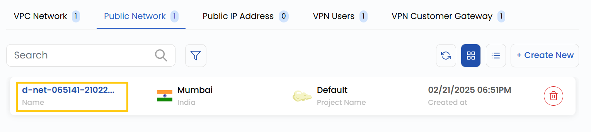
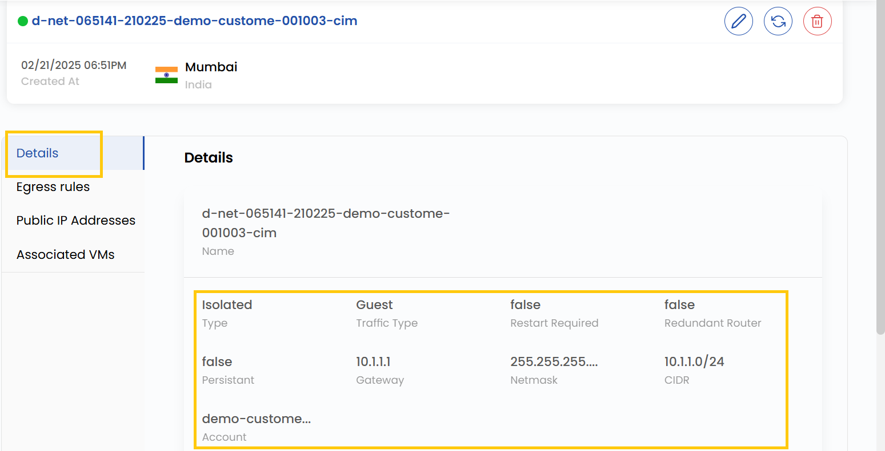

## Public Network Overview

A **Public Network** is a logically isolated network within a cloud environment. It allows you to control network settings such as IP addressing, subnets, routing, and security.

- To view a network instance, go to the **Networks** and navigate to the **Public Networks** section, where you can view the Public network and its size. 

- From **Details** tab you can view the detailed overview of your Public network.

- **Public ID**: The ID assigned to the Public.
- **Network Type:** Isolated (no external access) or Cached (temporary storage optimization).
- **Traffic Types:** The Guest user-facing traffic or Public internet access traffic.   
- **Required Files:** Essential for network operation.  
- **Redundant Router Files:** Backup router configurations.  
- **Persistent Files:** Configuration files retained across reboots.  
- **Gateway:** Access point between networks.  
- **Netmask:** Defines the subnet IP range.  
- **CIDR:** Specifies the network’s IP range.  
- **Account:** Represents the network’s name or identifier.  

### Conclusion

The **Public Network Overview** provides key details about your network’s configuration, including its type, traffic handling, and essential parameters like gateway, netmask, and CIDR. This helps in monitoring, managing, and ensuring efficient operation of your public network.

:::tip
**See also:**  
- **[Create Public Network](./Create%20Public%20Network.md)**
- **[Public IP Address](./Public%20IP%20Address.md)**
:::
