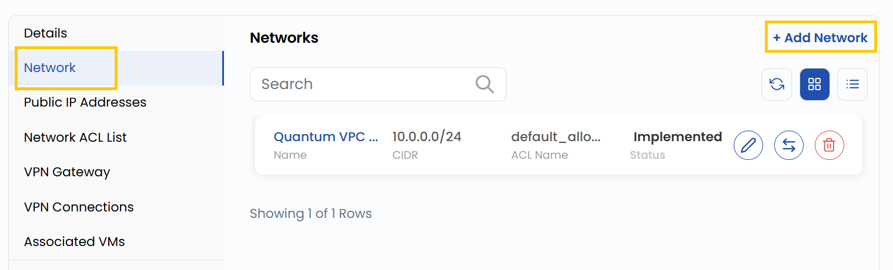
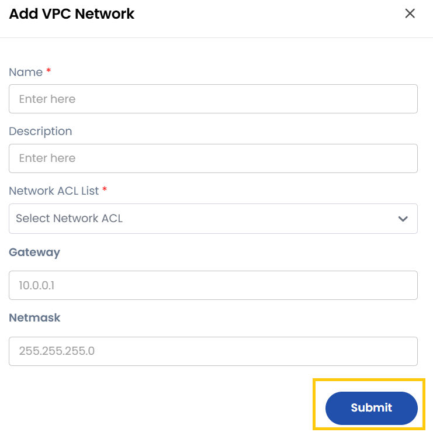

### **Add Network**

The Network tab displays all networks already created inside the VPC. You can also add a new network if needed.
- Navigate to the **Network** tab. Click **Add Network** to create a new network.

- To add VPC network you need to fill the form with network details.

- **Name**: The identifier for the network.
- **Description**: A summary of the network's purpose.
- **Network**: The subnet CIDR block (e.g., 192.168.1.0/24).
- **ACL (Access Control List)**: A predefined or new ACL to control inbound/outbound traffic.
- **Gateway**: The network gateway for routing traffic.
- **Network Mask**: Network mask in whcih the network is situated.
- Click **Submit** to create the new network.