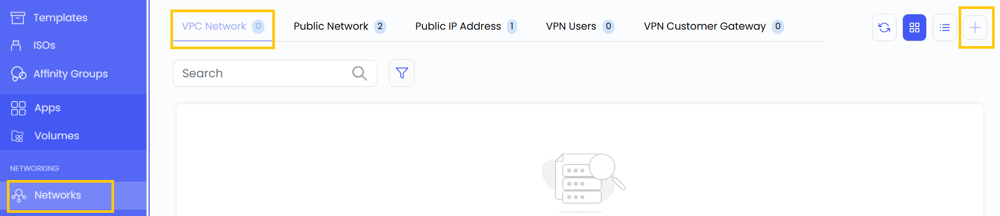
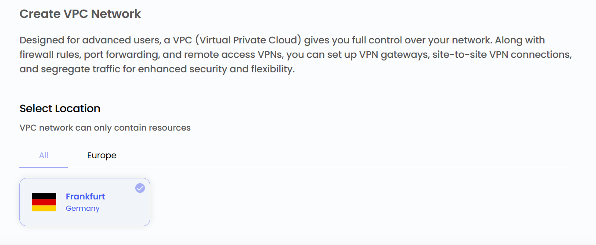
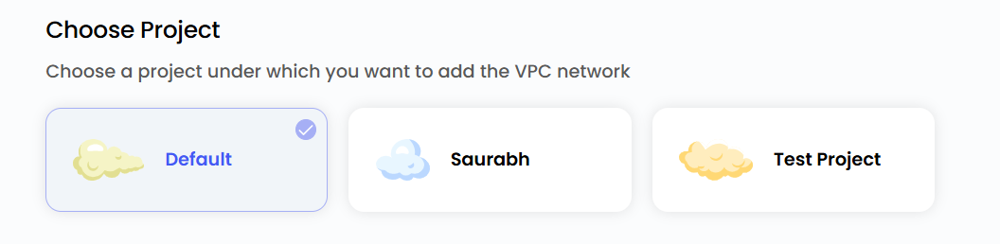
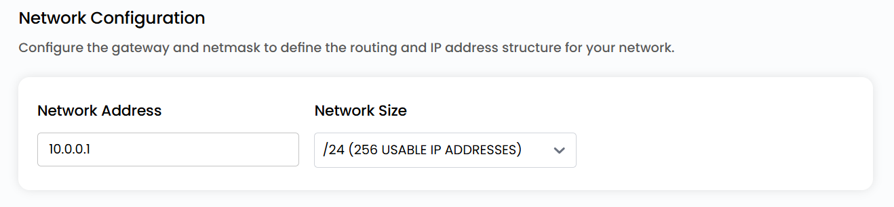
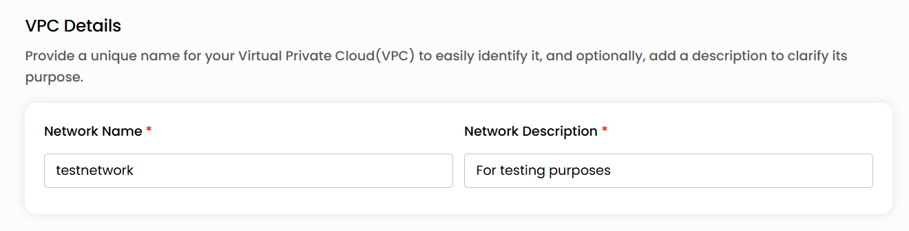
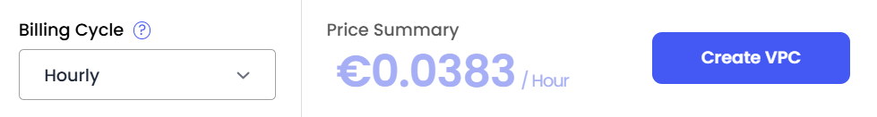

A **Virtual Private Cloud (VPC)** network in the Stack Console provides an isolated, secure, and scalable environment for cloud resources. It allows users to manage their networking infrastructure efficiently, ensuring communication between cloud instances while maintaining security and performance.

- From the left-hand menu, click on the **Networks** tab.
- You will be redirected to the **Networks** page. Go to the **VPC Network** tab.

- To create vpc network click the **plus (+)** icon located on the right side of the networks page.

### ### Choose a Location

- Select the data center location where your server will be physically hosted.
- Choose from the available locations listed.

### Assign to a Project

- You can choose projects to assign the server to one of your projects to organize and manage resources effectively.

### Network Configurations

- Configure the gateway and network mask to define the routing and IP address structure for your network. You can choose the size of the network from the available options.

### Choose VPC Network Name

- Provide a unique name for your Virtual Private Cloud(VPC) to easily identify it, and optionally, add a description to clarify its purpose.

### Create VPC Network

- Choose the desired **Billing Cycle** for your VPC Network. You can choose either Hourly or Monthly cycle.
- Verify all the configuration details and review the price summary. Click on **Create VPC** to create the VPC network.    

