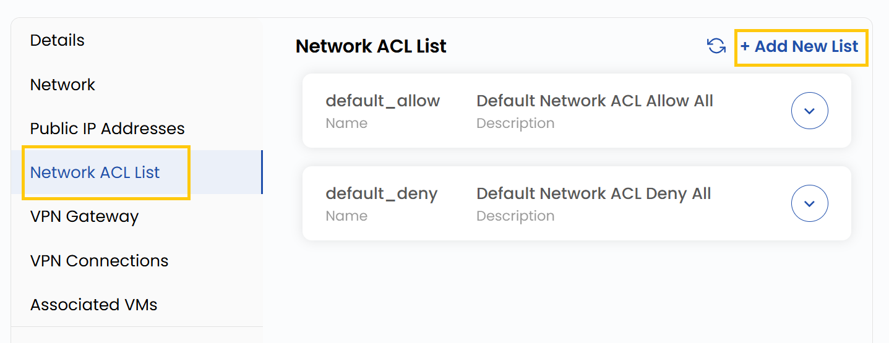

## Network ACL List

A **Network ACL** acts as a firewall that controls inbound and outbound traffic for subnets within the VPC.
- The Network ACL List tab displays all ACLs configured in the VPC.
- Click **Add New List** to create a new ACL. Provide **Name** and **Description** with brief summary of the ACL rules.
- Click **Submit** to create the ACL.

### Conclusion

The **Network ACL List** provides a centralized way to manage inbound and outbound traffic rules for VPC subnets. By creating and organizing ACLs, you can enhance security and maintain better control over network communication.

:::tip
**See also:**  
- **[VPC Network Overview](./Network%20Overview.md)**
- **[Create VPC Network](./Create%20VPC%20Network.md)**
- **[VPN Gateway](./Site%20VPN.md)**
- **[VPN Connections](./VPN%20Connection.md)**
:::

