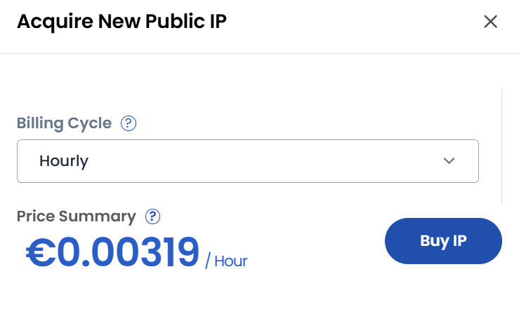

## Public IP Address

- Public IP addresses allow resources in the VPC to communicate with the internet.
- In the **Public IP Addresses** tab, you can see all assigned public IPs.

- Click **Aquire New IP** to request a new public IP. 
- Choose the desired **Billing Cycle** for your network and click on **Buy IP**.

### Conclusion

**Public IP Addresses** in a VPC enable seamless communication between cloud resources and the internet. Through the Public IP tab, you can easily acquire, view, and manage IPs with flexible billing options to support your connectivity needs.

:::tip
**See also:**  
- **[VPC Network Overview](./Network%20Overview.md)**
- **[Create VPC Network](./Create%20VPC%20Network.md)**
- **[VPN Gateway](./Site%20VPN.md)**
- **[VPN Connections](./VPN%20Connection.md)**
:::