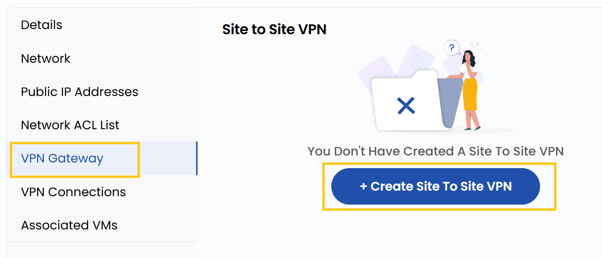

### **VPN Gateway**

A VPN Gateway allows secure communication between your VPC and external networks, such as on-premises data centers or other cloud networks.

- Navigate to the **VPN Gateway** tab to manage VPN Gateway connections.
- You can manage a Site-to-Site VPN, which connects two networks securely.

