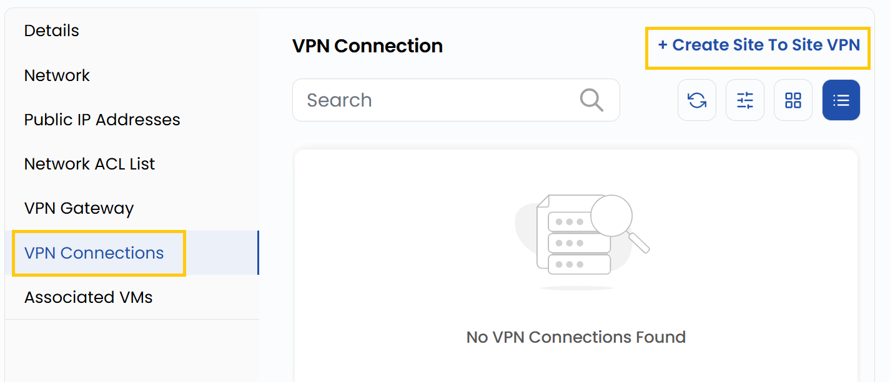
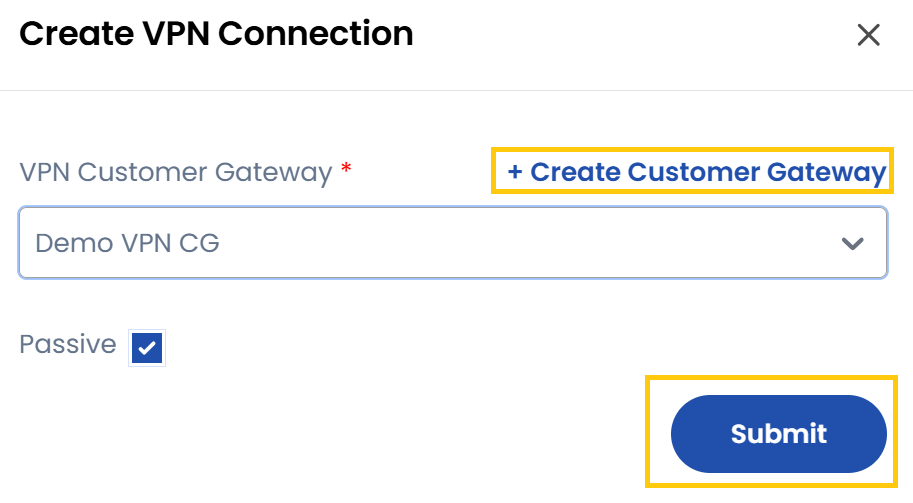

### **VPN Connections**

A VPN Gateway allows secure communication between your VPC and external networks, such as on-premises data centers or other cloud networks.

- Navigate to the **VPN Connections** tab to manage VPN connections.
- You can create a Site-to-Site VPN, which connects two networks securely.
- Click on **Create Site To Site VPN**

- Select or create the **VPN Customer Gateway**, check if you want **Passive** connection and then click on **Submit**. 

