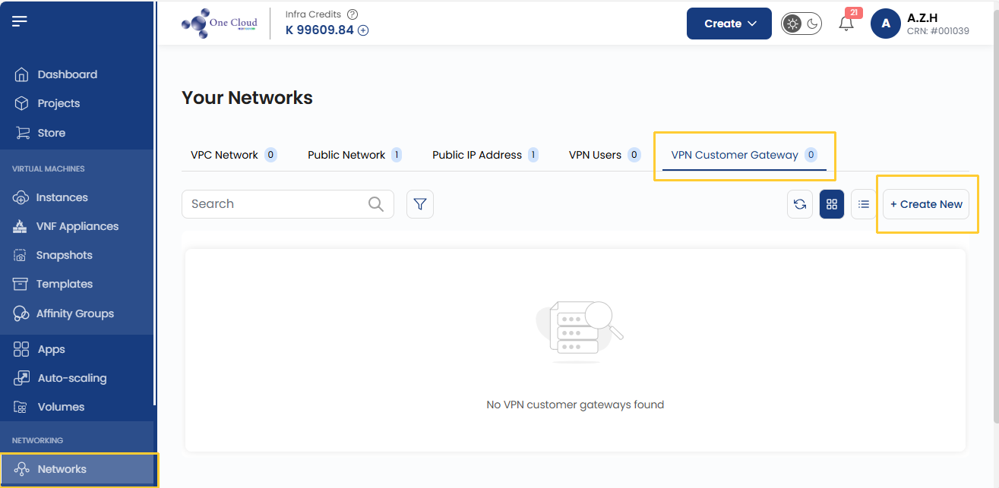
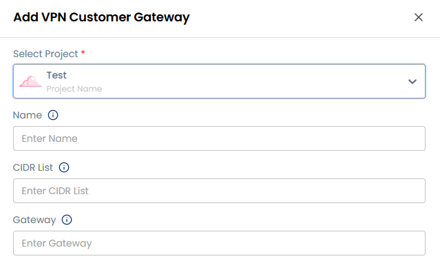
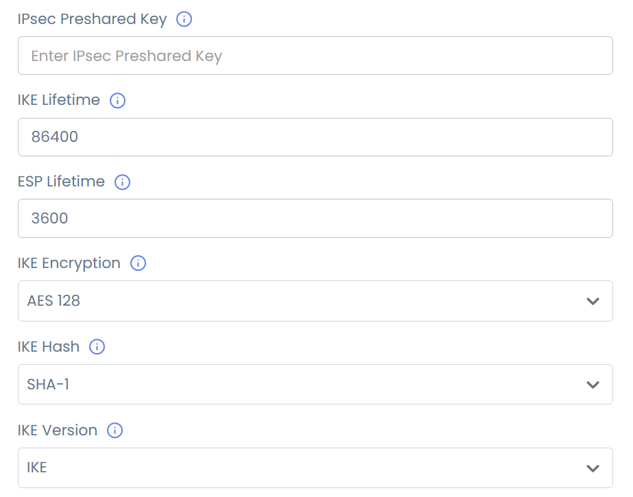
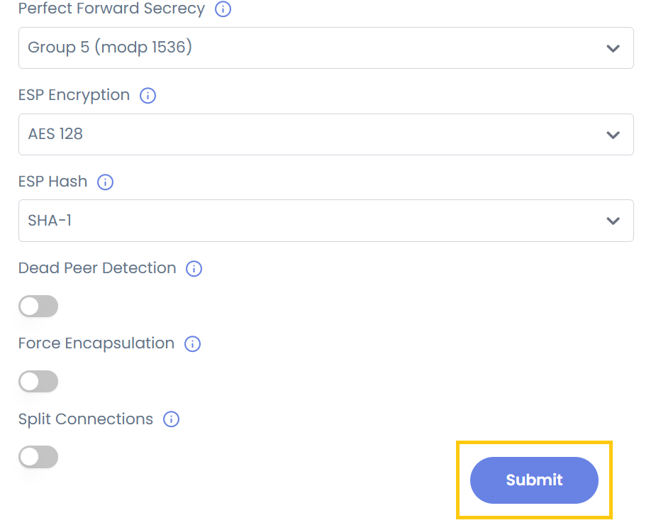

## VPN Customer Gateway

A **VPN Customer Gateway** is an essential component for establishing a secure VPN connection between your on-premises network and a cloud provider. In 1CNG, this allows secure communication between your private network and virtual private cloud (VPC). Follow this step-by-step guide to configure and add a VPN Customer Gateway in 1CNG.

- From the left-hand menu, click on the **Networks** tab.
- You will be redirected to the **Networks** page. Go to the **VPN Customer Gateway** tab.
- Click on the **plus (+)** icon to add a new VPN Customer Gateway. A form will appear where you need to enter the configuration details

- **Select Project**: Choose the project where the VPN Customer Gateway will be deployed.
- **Select Zone**: Pick the appropriate zone or region for your VPN gateway.
- **Name**: Provide a unique, identifiable name for the VPN Customer Gateway.
- **CIDR List**: Define the IP range (in CIDR format) allowed for communication between your network and the cloud.
- **Gateway**: Provide the public IP address of your on-premises VPN device (router or firewall).

 
### Gateway Configurations

To establish a secure connection, configure the following IPsec and IKE (Internet Key Exchange) parameters.

- **IPsec Pre-Shared Key**: A shared secret used for authentication between VPN devices.
- **IKE Lifetime**: Define the duration (in seconds) for which an IKE session remains active (e.g., 28800 seconds).
- **ESP Lifetime**: Set the lifetime of the Encapsulating Security Payload (ESP) session.
- **IKE Encryption Algorithm**: Select the encryption method for the IKE phase (e.g., AES-256, AES-128).
- **IKE Hash Algorithm**: Choose the hashing algorithm for data integrity (e.g., SHA-256, SHA-512).
- **IKE Version**: Specify IKEv1 or IKEv2 (IKEv2 is recommended for better security).
- **IKE DH (Diffie-Hellman Group)**: Select a DH group for key exchange security (e.g., Group 14, Group 19).
- **Perfect Forward Secrecy (PFS)**: Enable PFS to ensure each key exchange is independent.
- **ESP Encryption Algorithm**: Choose the encryption method for ESP (e.g., AES-256).
- **ESP Hash Algorithm**: Select the hashing method for ESP integrity verification (e.g., SHA-256)

### Enable Advanced Features (Optional)

1CNG provides additional security and performance features that can be enabled by toggling advance options.

- **Dead Peer Detection (DPD)**: Monitors and automatically restores lost VPN connections.
- **Force Encapsulation**: Ensures VPN traffic passes through firewalls and NAT devices.
- **Split Connections**: Enables multiple VPN tunnels for better redundancy and performance.

- Click on **Submit** and your VPN Customer Gateway will be created.

### Conclusion

The **VPN Customer Gateway** enables secure connectivity between your on-premises infrastructure and the cloud VPC. With configurable encryption, authentication, and advanced features, it ensures reliable, private, and high-performance communication across hybrid environments.

:::tip
**See also:**  
- **[VPN Users](./VPN%20Users.md)**
:::
