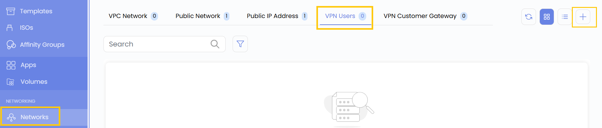
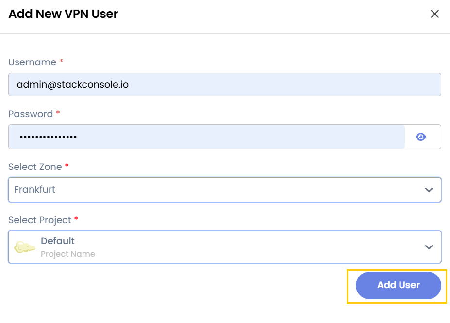

## VPN Users

A **VPN User** in Stack Console refers to an authenticated individual who connects to the cloud environment via a Virtual Private Network (VPN). This ensures secure remote access to private cloud resources.

- From the left-hand menu, click on the **Networks** tab.
- You will be redirected to the **Networks** page. Go to the **VPN Users** tab.

- Click on the **plus (+)** icon to add a new VPN User. A form will appear where you need to enter the configuration details

- Enter your **Username** and **Password** of Stack Console's account. To create VPN user, select the **Project** and **Zone**.
- Click on **Add User** to add vpn user.

### Conclusion

The **VPN Users** feature allows you to securely add and manage authenticated users for remote access to cloud resources, ensuring safe connectivity and controlled access within your projects.

:::tip
**See also:**  
- **[VPN Customer Gateway](./VPN%20Customer%20Gateway.md)**
:::