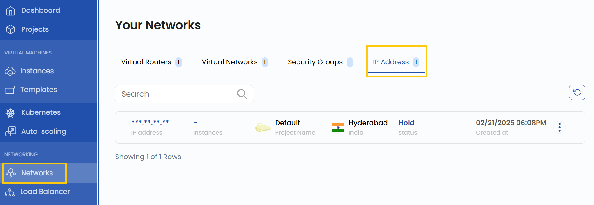

## IP Address

An **IP Address** is a public IP that can be dynamically assigned to different virtual machines (VMs) within a cloud environment. In StackConsole, IPs allow external access to cloud instances and enable flexible network configurations. This guide provides step-by-step instructions for creating, attaching, and releasing IP Addresses in StackConsole.

--------

### Creating IP Address

- From the left-hand menu, click on the **Networks** tab.
- You will be redirected to the **Networks** page. Go to the **IP Address** tab.

- To create an IP Address, click the **Create New** button located on the right side of the networks page.

### Manage IP Address

- Once the IP Address is created, you can manage it using the options available in the three-dot menu on the right-hand side of the IP instance.

#### **Releasing an IP**

- Click on the three dots next to the IP.
- Select **Release IP** from the options.
- Confirm the action to release the IP back to the available pool.
- Once released, the IP will no longer be associated with any VM.

### Conclusion

By following this guide, you can easily create and manage IP Addresses in StackConsole. IPs provide flexibility in managing network configurations and ensuring external access to your cloud instances. For further assistance, refer to the StackConsole documentation or reach out to support.
