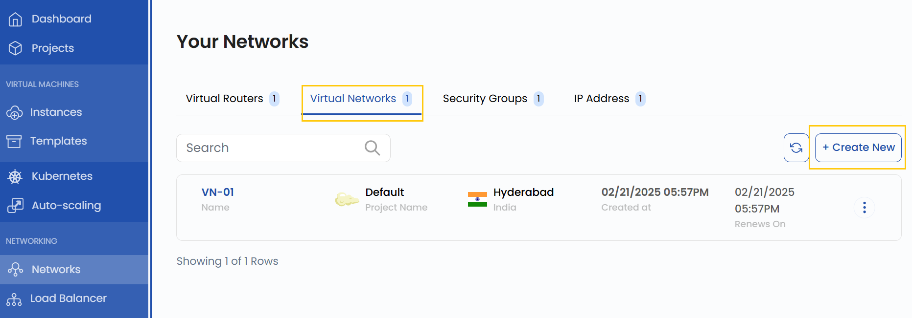
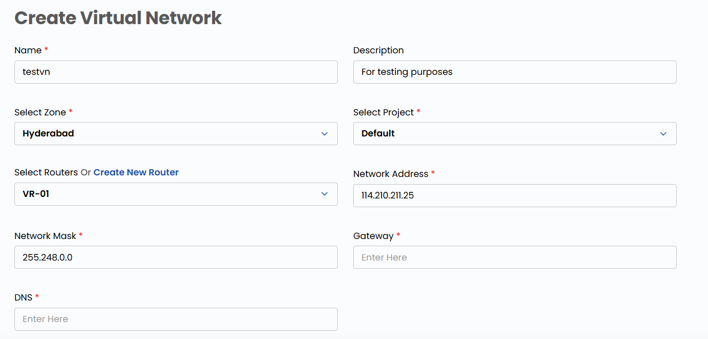
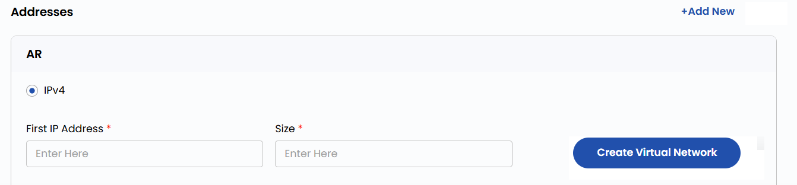
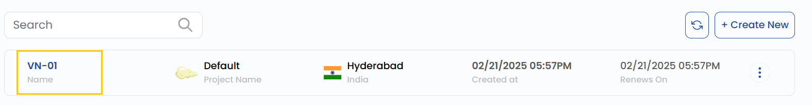
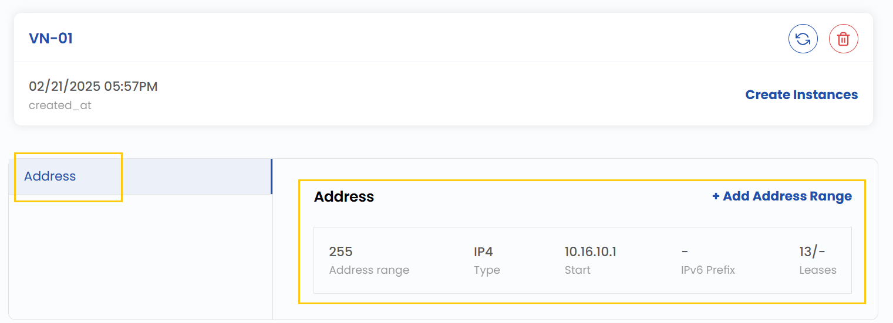

## Virtual Network

A **Virtual Network** is a logically isolated network that enables communication between cloud resources within a controlled environment. In StackConsole, virtual networks allow users to define IP address ranges, configure routers, and manage network settings for seamless connectivity between virtual machines and other cloud resources. This guide provides step-by-step instructions for creating a virtual network.

------

### Creating a Virtual Network

- From the left-hand menu, click on the **Networks** tab.
- You will be redirected to the **Networks** page. Go to the **Virtual Networks** tab.

- To create a Virtual Network, click the **Create New** button located on the right side of the networks page.

- A form will appear where you need to enter the **Name** and **Description**. Select the appropriate **Zone** and choose the relevant **Project**.

- Also, you need to select the **Router** or create one, then fill in the appropriate network settings:
  - **Network Address**: Define the network address (CIDR format).
  - **Network Mask**: Specify the subnet mask.
  - **Gateway**: Enter the default gateway.
  - **DNS**: Input the DNS settings.

- To add IP Addresses from the Addresses section, choose IPv4 as the address type:
  - **First IP Address**: Define the starting IP.
  - **Size of IPv4**: Specify the subnet size.

- Click on **Create Virtual Network** to create the virtual network.

- Once created, click on the virtual network to view associated addresses.

- You can also create instances or define an address range from this interface.

### Conclusion

By following this guide, you can easily create and manage Virtual Networks in StackConsole. Virtual Networks provide a secure and isolated environment for your cloud resources, ensuring seamless connectivity and efficient network management. For further assistance, refer to the StackConsole documentation or reach out to support.
