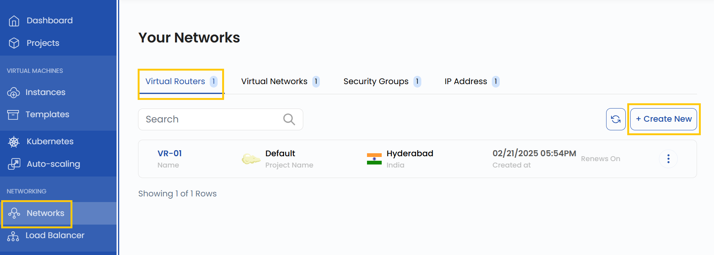
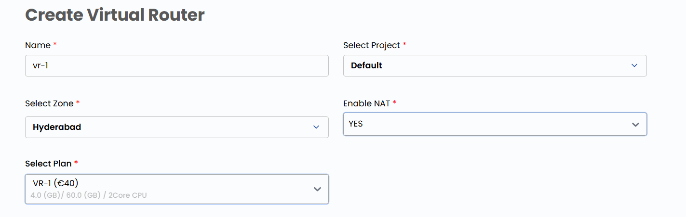
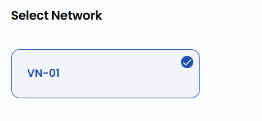
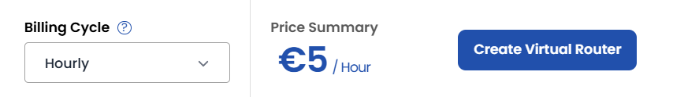
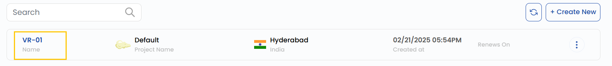
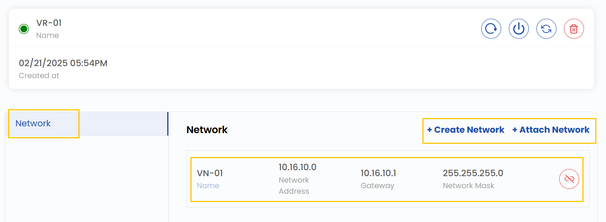
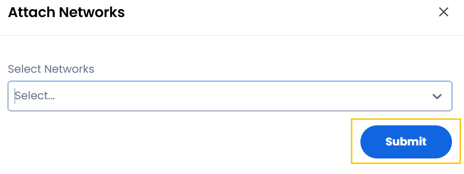

## Virtual Router

A **Virtual Router** is a software-based router that facilitates network traffic management between different subnets and virtual networks within a cloud environment. In StackConsole, a Virtual Router enables efficient routing, integration with various network components, and enhanced connectivity between cloud resources. This guide provides step-by-step instructions to create and manage a Virtual Router.

-------

### Creating a Virtual Router

- From the left-hand menu, click on the **Networks** tab.
- You will be redirected to the **Networks** page. Go to the **Virtual Routers** tab.

- To create a Virtual Router, click the **Create New** button located on the right side of the networks page.
- Provide a name for the Virtual Router, select the project, and choose the appropriate zone where the data center will be located.
- Select the Virtual Router plan that best suits your requirements.

- Choose the network from the list to create the Virtual Router.

- Choose the desired **Billing Cycle** for your router. You can choose either Hourly or Monthly.
- Verify all the configuration details and review the price summary. Click on **Create Virtual Router** to create the router.

### Managing Virtual Router

- Once the Virtual Router is created, click on its instance to view details. You will be redirected to its management page, where you can:

- View Virtual Router details and manage interfaces.
- Filter, attach, or integrate network components with the Virtual Router.

- To attach a network, click on **Attach Network** and select the network. Click on **Submit**.

### Conclusion

By following this guide, you can easily create and manage Virtual Routers in StackConsole. Virtual Routers provide a flexible and efficient way to manage network traffic, ensuring seamless connectivity between subnets and virtual networks. For further assistance, refer to the StackConsole documentation or reach out to support.
