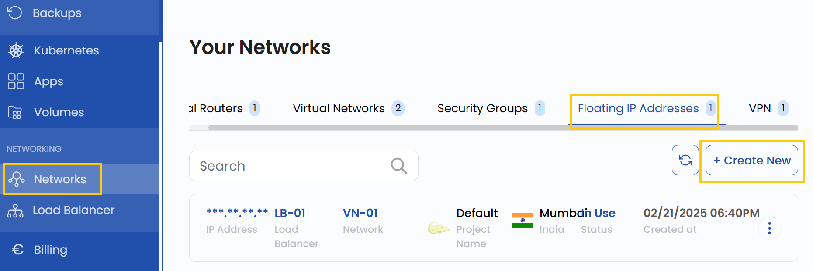
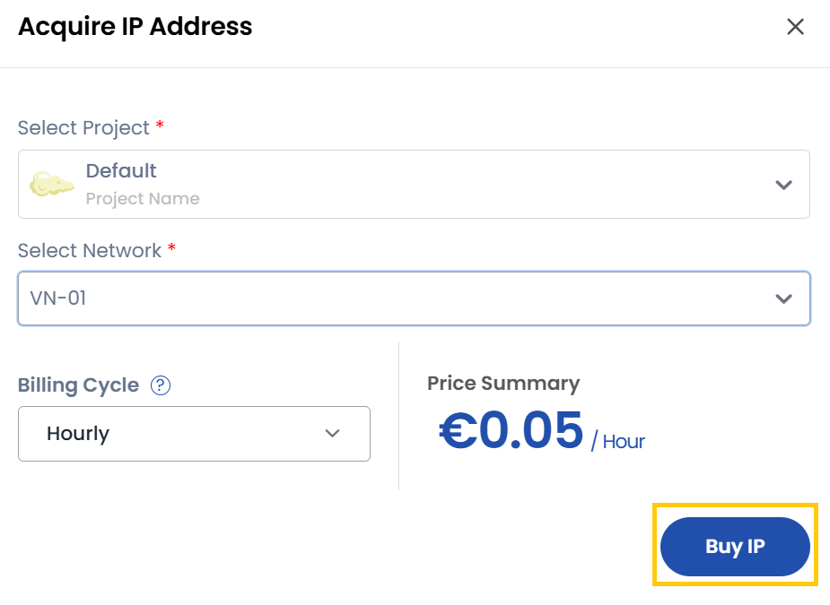
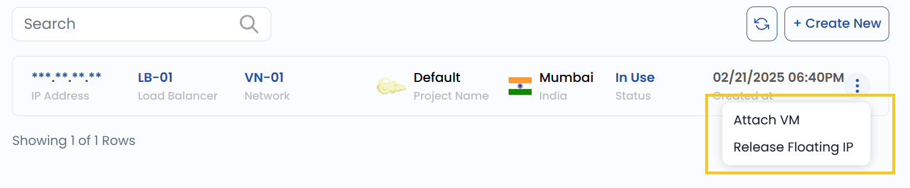

## Floating IP Address

A **Floating IP Address** is a public IP that can be dynamically assigned to different virtual machines (VMs) within a cloud environment. In StackConsole, Floating IPs allow external access to cloud instances and enable flexible network configurations. This guide provides step-by-step instructions for creating, attaching, and releasing Floating IP Addresses in StackConsole.

--------

### Creating Floating IP Address

- From the left-hand menu, click on the **Networks** tab.
- You will be redirected to the **Networks** page. Go to the **Floating IP Addresses** tab.

- To create a Floating IP Address, click the **Create New** button located on the right side of the networks page.

### Acquire IP Address

- Select the project where the Floating IP will be created.
- Choose the **Network** to associate with the Floating IP.
- Click on **Buy IP** to allocate the Floating IP Address. The Floating IP will now be created and available for use.

### Manage Floating IP Address

- Once the Floating IP Address is created, you can manage it using the options available in the three-dot menu on the right-hand side of the Floating IP instance.

**Attaching a Floating IP to a VM**

- Click on the three dots next to the created Floating IP.
- Select **Attach VM** from the options.
- Choose the virtual machine to which you want to attach the Floating IP.
- Click on **Attach** to confirm the selection. The Floating IP will be assigned to the VM.

**Releasing a Floating IP**

- Click on the three dots next to the Floating IP.
- Select **Release Floating IP** from the options.
- Confirm the action to release the Floating IP back to the available pool.
- Once released, the Floating IP will no longer be associated with any VM.

### Conclusion

By following this guide, you can easily create, attach, and manage Floating IP Addresses in StackConsole. Floating IPs provide flexibility in managing network configurations and ensuring external access to your cloud instances. For further assistance, refer to the StackConsole documentation or reach out to support.
