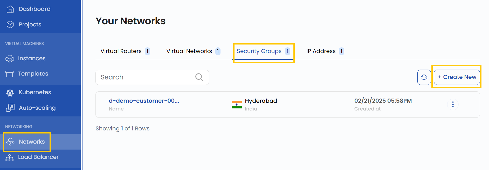
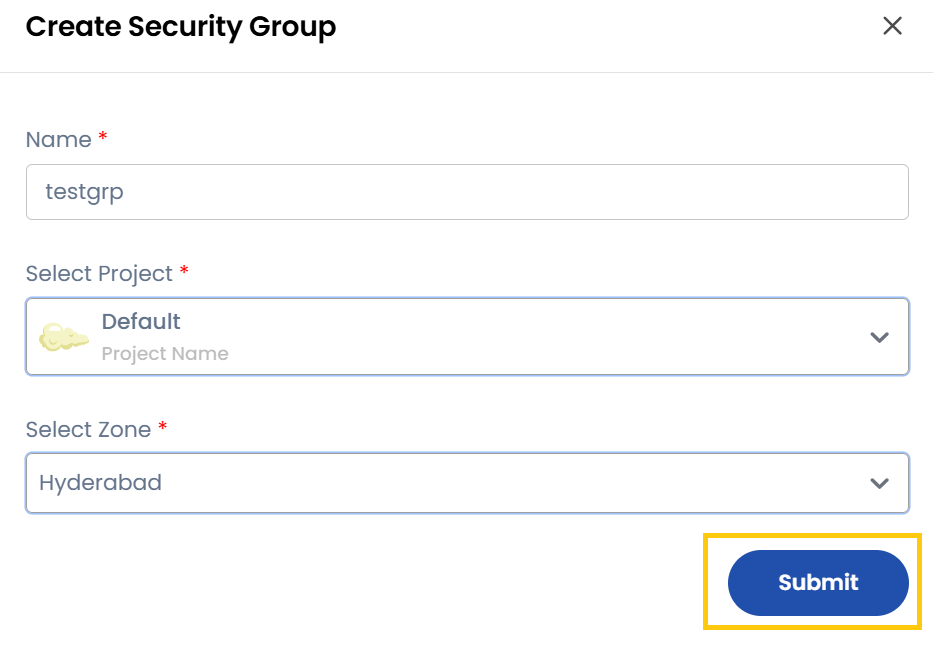
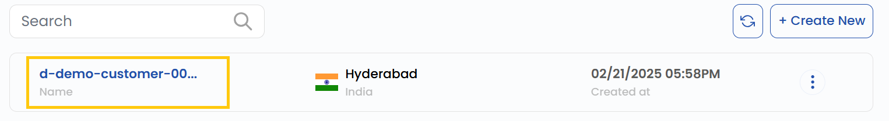
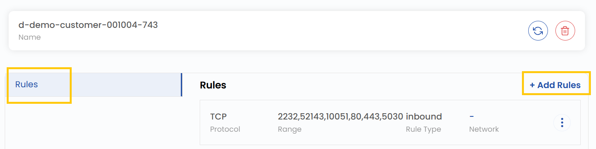

## Security Group for Network

A **Security Group** acts as a virtual firewall that controls inbound and outbound traffic to and from cloud resources in StackConsole. It allows users to define specific rules for managing network access based on protocols, ports, and traffic direction. This guide provides step-by-step instructions for creating and managing Security Groups in StackConsole, including adding firewall rules to regulate network traffic effectively.

-------

### Creating Security Group

- From the left-hand menu, click on the **Networks** tab.
- You will be redirected to the **Networks** page. Go to the **Security Groups** tab.

- To create a Security Group, click the **Create New** button located on the right side of the networks page.

### Configure Security Group

- To create a security group, enter the security group’s name.
- Select the project where the security group will be created and choose the appropriate zone.
- Click on **Submit** to create the security group.

### View Security Group Details

- Once created, click on the security group to view its details.
- Here, you can see the rules associated with the security group.

### Add Firewall Rules

- Navigate to the created security group and click on **Add Rules**.

- This will open a form to define firewall egress or ingress rules.

- **Traffic Direction**: Select Ingress (incoming) or Egress (outgoing).
- **Description**: Provide a brief description of the rule.
- **Protocol**: Choose from TCP, UDP, ICMP, or CIDF.
- **Open Port Range**: Select Port or Port Range and enter the specific port or range of ports.
- **Remote Selection**: Choose CIDR or Security Group. If you select CIDR, enter the CIDR range.
- To create the rule, click on **Submit** to finalize the rule addition. The rule will now be applied under the selected security group.

### Conclusion

By following this guide, you can easily create and manage Security Groups in StackConsole. Security Groups provide a flexible and powerful way to control network traffic, ensuring that your cloud resources remain secure and accessible only to authorized traffic. For further assistance, refer to the StackConsole documentation or reach out to support.

:::tip
**See also:**  
- **[Virtual Routers](./Virtual%20Routers.md)**
- **[Virtual Networks](./Virtual%20Networks.md)**
:::