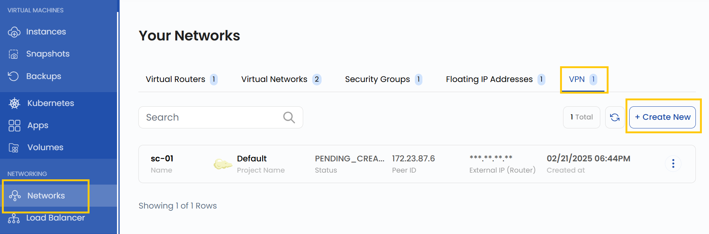
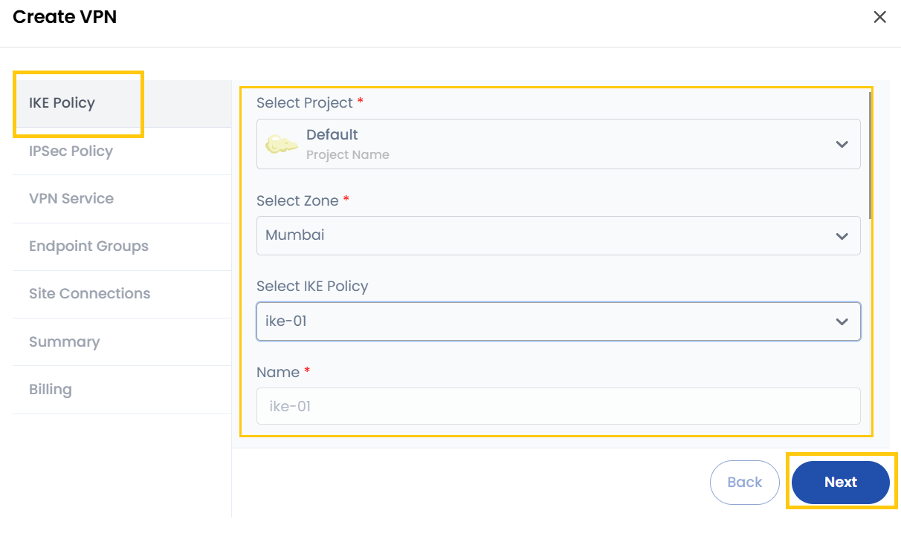
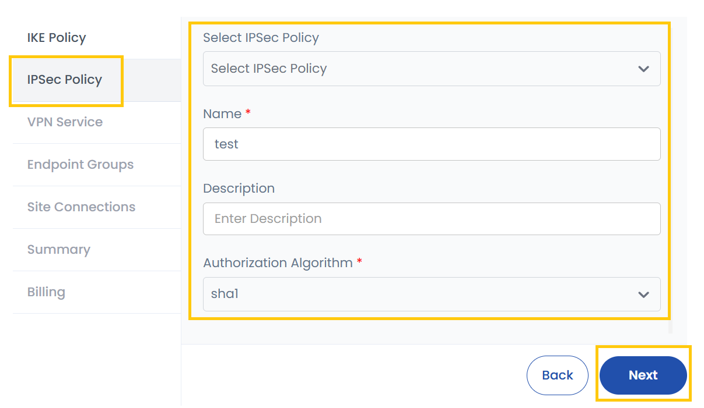
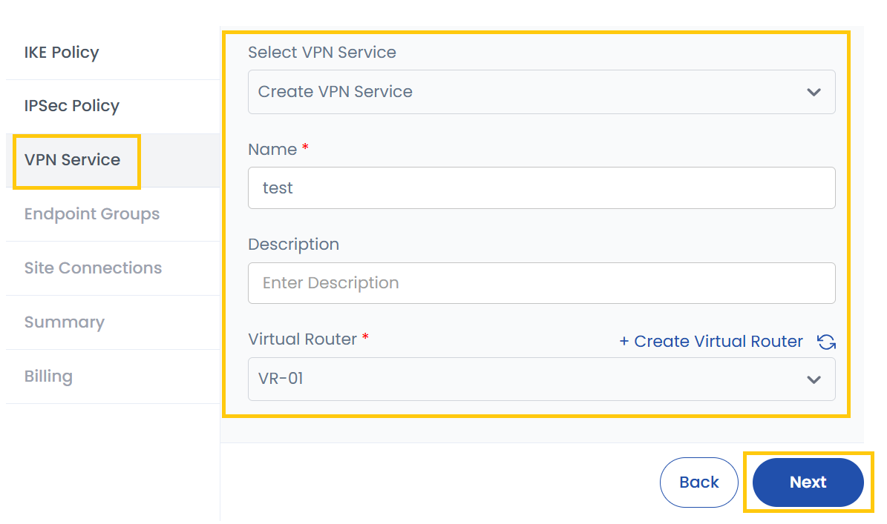
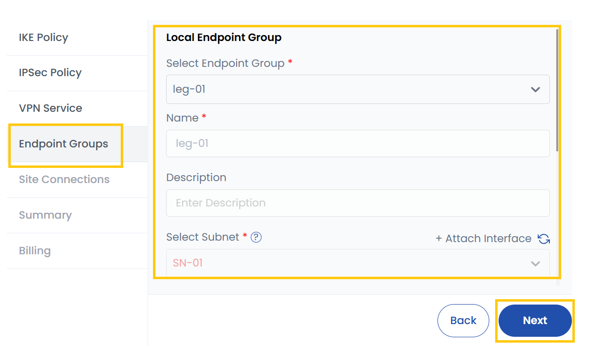
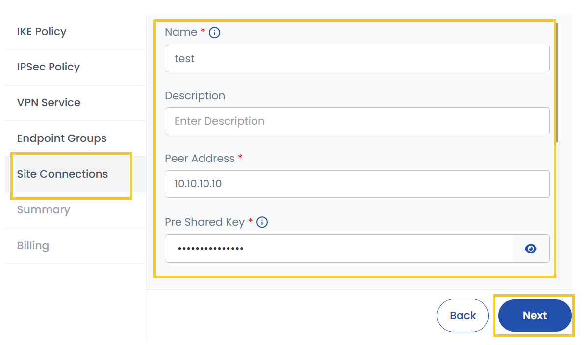
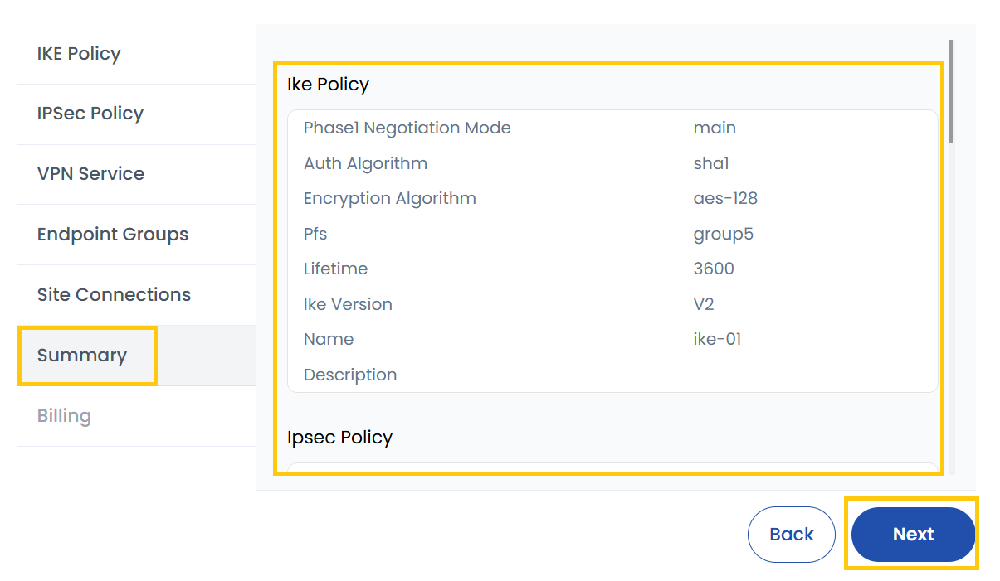
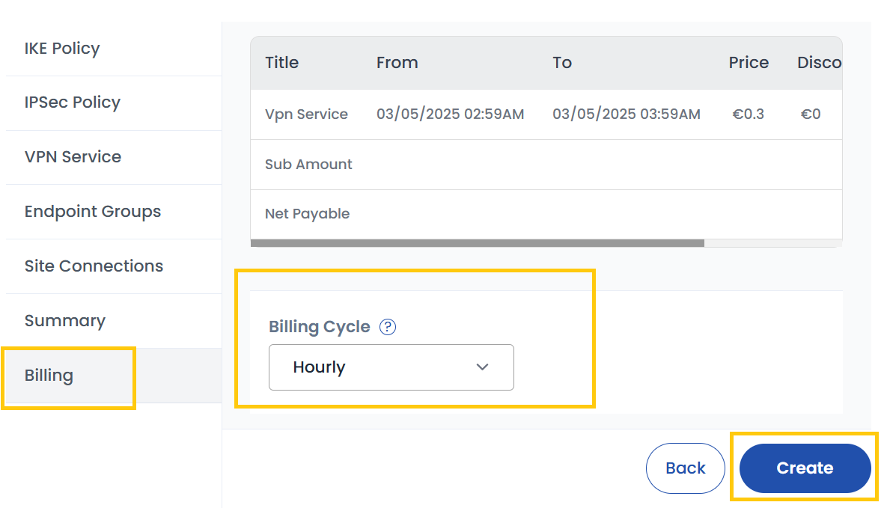

## VPN

A **VPN (Virtual Private Network)** is a technology that creates a secure and encrypted connection between two or more devices over the internet. It allows users to transmit data privately and securely, even when using public or untrusted networks. In Stack Console, you can create a VPN by configuring different settings, including IKE Policy, IPsec Policy, VPN Service, Endpoint Groups, and Site Connection. This process ensures that your data remains secure while traveling between different networks.

-----

### Creating VPN for Network

- From the left-hand menu, click on the **Networks** tab.
- You will be redirected to the **Networks** page. Go to the **VPN** tab.

- To create a VPN, click the **Create New** button located on the right side of the networks page.

### IKE Policy

The IKE (Internet Key Exchange) Policy defines the settings for secure key exchange between two VPN endpoints. It is used in Phase 1 of the VPN negotiation process. The policy determines how encryption and authentication take place between the VPN gateways.

- **Project**: Select the project under which this VPN setup will be managed.
- **Zone**: Choose the geographical location (data center/region) where the VPN gateway will be created.
- **IKE Policy**: Select an existing IKE policy or create a new one.
- **Name**: Give a unique name to this IKE policy.
- **Description**: Optionally, provide additional information about the policy.
- **Authorization Algorithm**: Defines the authentication method used for verifying the VPN connection. Common algorithms include SHA-1, SHA-256, or SHA-512.
- **Encryption Algorithm**: Specifies the encryption method used to secure VPN data, such as AES-128, AES-256.
- **Perfect Forward Secrecy (PFS)**: If enabled, this ensures that even if one encryption key is compromised, past and future communications remain secure.
- **IKE Version (Optional)**: Choose the version of the IKE protocol (IKEv1 or IKEv2). If unsure, leave it as default.
- **Lifetime (Seconds)**: Determines how long the IKE session remains valid before it needs to be re-established. A typical value is 86400 seconds (24 hours).
- **Phase Mode (Optional)**: Defines the Phase 1 negotiation mode with **Main Mode** (more secure but slower) or **Aggressive Mode** (faster but less secure).

After filling out this information, proceed to the next tab.

### IPSec Policy

The IPsec (Internet Protocol Security) Policy defines the security settings for Phase 2 of the VPN connection, where the actual data is encrypted and transmitted.

- **IPsec Policy**: Select or create an IPsec policy.
- **Name**: Provide a name for the policy.
- **Description**: Optionally, add details about this policy.
- **Authorization Algorithm**: Used for authentication and integrity. Example: SHA-256, SHA-512.
- **Encapsulation Mode**: Defines how data is transmitted:
  - **Tunnel Mode**: Encrypts the entire packet (recommended for site-to-site VPNs).
  - **Transport Mode**: Encrypts only the payload, not the headers (used in host-to-host communication).
- **Encryption Algorithm**: Defines how data is encrypted. Common options include AES-128, AES-256.
- **Perfect Forward Secrecy (PFS)**: Ensures new encryption keys are generated for each session.
- **Lifetime (Seconds)**: Defines how long the security association (SA) remains valid before re-negotiation. Common values: 3600 – 86400 seconds.

### VPN Service

The VPN Service is the actual VPN gateway that will manage traffic between two networks. This is where you configure the network infrastructure of the VPN.

- **VPN Service**: Select an existing VPN service or create a new one.
- **New Name**: Provide a unique name for the VPN service.
- **Description**: Optionally, add a description.
- **Virtual Router**: Choose an existing virtual router or create a new one. A virtual router is responsible for routing VPN traffic between local and remote networks.

### Endpoint Groups

An Endpoint Group defines the local and remote networks participating in the VPN connection.

**Local Endpoint Group**

- **Select Local Endpoint Group**: Choose from the list of existing endpoint groups.
- **Name**: Assign a name to the local endpoint group.
- **Description**: Provide additional details.
- **Subnet**: Select the subnet for this group. This defines which part of your network is accessible over the VPN.
- **Attach Interface (Optional)**: Instead of selecting a subnet, you can attach a network interface to the VPN.

**Peer Endpoint Group**

- **Select Peer Endpoint Group Policy**: Choose an endpoint group policy for the remote site.
- **Name**: Provide a name.
- **Description**: Optionally, enter a description.
- **Endpoints**: Specify the remote network’s endpoints.
- **Add Endpoints (Optional)**: Manually add additional endpoints if required.

### Site Connections

The Site Connection defines how your VPN connects to the remote site, including authentication details and connection settings.

- **Name**: Assign a name to the VPN connection.
- **Description**: Provide additional details.
- **Peer Address**: Enter the public IP address of the remote VPN gateway.
- **Peer Shared Key**: This is a pre-shared key (PSK) used for authentication between the two VPN gateways.
- **DPD (Dead Peer Detection)**: Determines what happens if the VPN peer stops responding:
  - **Clear**: Removes the connection immediately if the peer is unresponsive.
  - **Hold**: Keeps the connection but stops traffic until the peer responds.
  - **Restart**: Tries to re-establish the connection automatically.
  - **Disabled**: Disables DPD, meaning no checks for peer availability.
  - **Restart by Peer**: Allows the peer to initiate re-connection if it becomes available again.
- **DPD Timeout**: Defines how long to wait before considering the peer unresponsive.
- **DPD Interval**: The frequency at which DPD checks are sent.
- **MTU (Maximum Transmission Unit)**: Defines the largest packet size that can be sent. Typical values: 1400-1500 bytes.
- **Peer ID**: The unique identifier of the remote peer.

### Summary

Review all details entered in previous steps and ensure all settings are correct before proceeding. Click on **Next** to finalize and proceed to billing.

### Billing

- Choose the desired **Billing Cycle** for your VPN. VPN supports Hourly, Monthly, Quarterly, Semiannually, Yearly, Bi-annually, and Tri-annually billing cycles. 
- Supported billing rules include Date to Date, Fixed Calendar Month, Unfixed Calendar Month, Fixed Prorata, and Unfixed Prorata.
- There is no specific package detail mentioned, but VPN services integrate with networking components like VPCs to provide secure access across environments.
- Verify all the configuration details and review the price summary. Click on **Create** to create the VPN.

### Conclusion

By following this guide, you can easily create and manage a VPN on Stack Console. VPNs provide a secure and encrypted connection for transmitting data between networks, ensuring privacy and security. For further assistance, refer to the Stack Console documentation or reach out to support.
