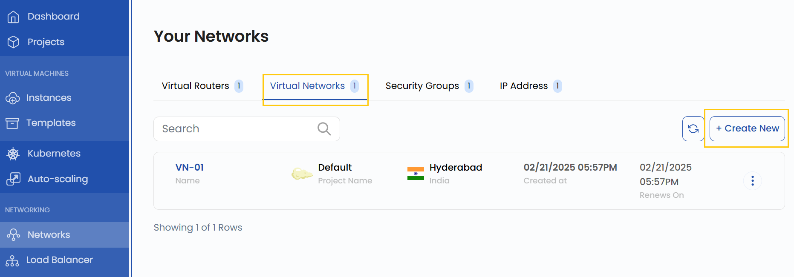
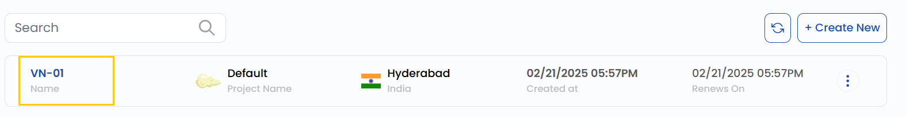
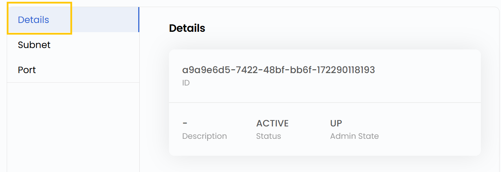
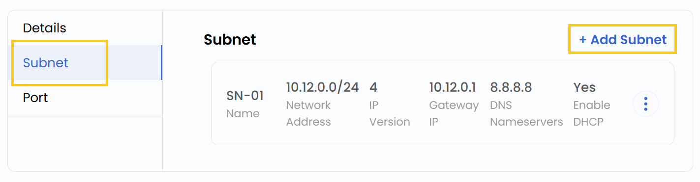
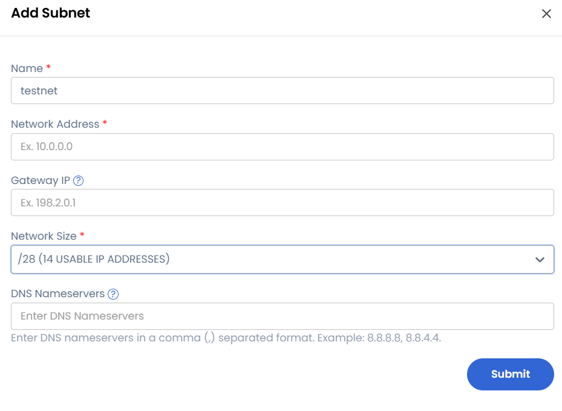
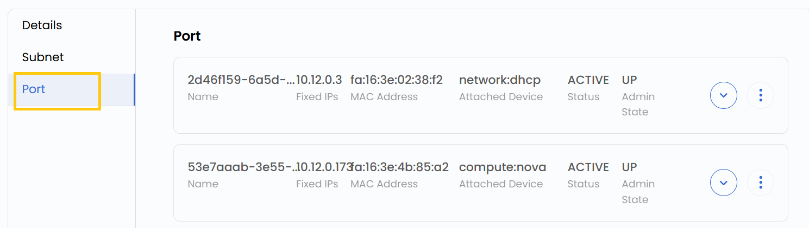

## Virtual Network

A **Virtual Network** is a logically isolated network that enables communication between cloud resources within a controlled environment. In StackConsole, virtual networks allow users to define IP address ranges, configure routers, and manage network settings for seamless connectivity between virtual machines and other cloud resources. This guide provides step-by-step instructions for creating a virtual network.

------

### Creating a Virtual Network

- From the left-hand menu, click on the **Networks** tab.
- You will be redirected to the **Networks** page. Go to the **Virtual Networks** tab.

- To create a Virtual Network, click the **Create New** button located on the right side of the networks page.

### Choose a Project

- Choose a project under which you want to add the Virtual Network.

### Choose a Location

- Select the data center location where your virtual network server will be physically hosted.
- Choose from the available locations listed.

### Virtual Network Name

- Provide a unique **Name** and a valid **Description** for your virtual network to identify it easily in your dashboard.

- Click on **Create Virtual Network** to create the virtual network.

### Managing Virtual Network

- Once created, click on the virtual network to view associated addresses.

- You can view Virtual Router details and manage interfaces.
- Also, filter, attach, or integrate network components with the Virtual Network.

### Conclusion

By following this guide, you can easily create and manage Virtual Networks in StackConsole. Virtual Networks provide a secure and isolated environment for your cloud resources, ensuring seamless connectivity and efficient network management. For further assistance, refer to the StackConsole documentation or reach out to support.
