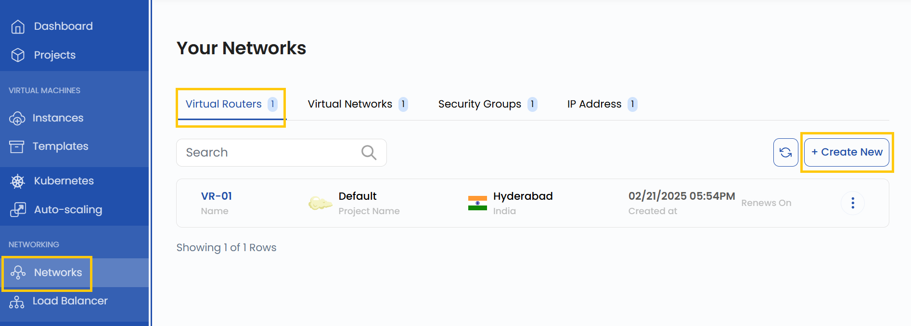
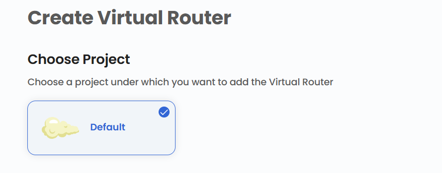
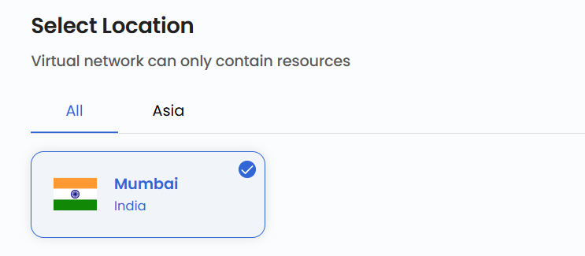
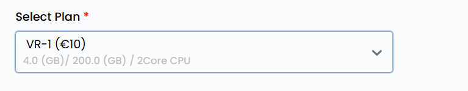
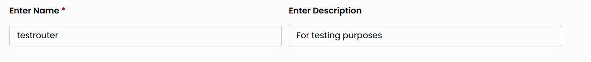
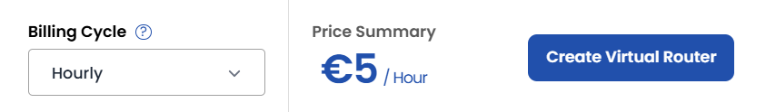
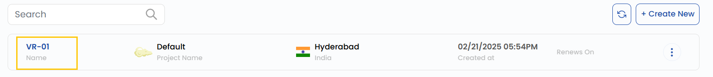
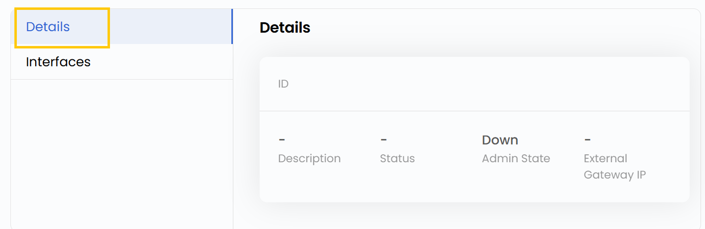
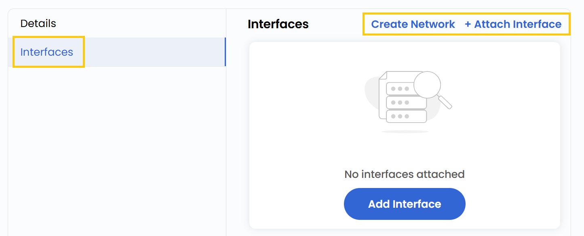

## Virtual Router for Network

A **Virtual Router** is a software-based router that facilitates network traffic management between different subnets and virtual networks within a cloud environment. In StackConsole, a Virtual Router enables efficient routing, integration with various network components, and enhanced connectivity between cloud resources. This guide provides step-by-step instructions to create and manage a Virtual Router.

-------

### Creating a Virtual Router

- From the left-hand menu, click on the **Networks** tab.
- You will be redirected to the **Networks** page. Go to the **Virtual Routers** tab.

- To create a Virtual Router, click the **Create New** button located on the right side of the networks page.

### Choose a Project

- Choose a project under which you want to add the Virtual Router.

### Choose a Location

- Select the data center location where your virtual router server will be physically hosted.
- Choose from the available locations listed.

### Select a Plan

- Select a plan based on your requirements like CPU, memory, storage, and bandwidth.

### Virtual Router Name

- Provide a unique **Name** and a valid **Description** for your virtual router to identify it easily in your dashboard.

### Review and Deploy

- Choose the desired **Billing Cycle** for your router. Virtual Router supports Hourly, Monthly, Quarterly, Semiannually, Yearly, Bi-annually, and Tri-annually billing cycles. 
- It also supports Date to Date, Fixed Calendar Month, Unfixed Calendar Month, Fixed Prorata, and Unfixed Prorata billing rules.
- It offers multiple router packages with varying networking capabilities. This enables flexible network topologies to meet performance, security, and connectivity requirements.
- Verify all the configuration details and review the price summary. Click on **Create Virtual Router** to create the router.

### Managing Virtual Router

- Once the Virtual Router is created, click on its instance to view details. You will be redirected to its management page.

- You can view Virtual Router details and manage interfaces.
- Also, filter, attach, or integrate network components with the Virtual Router.

- To attach a network, go to **Interfaces** tab. Click on **Attach Interface** and select the network with subnet. Click on **Submit**.

### Conclusion

By following this guide, you can easily create and manage Virtual Routers in StackConsole. Virtual Routers provide a flexible and efficient way to manage network traffic, ensuring seamless connectivity between subnets and virtual networks. For further assistance, refer to the StackConsole documentation or reach out to support.

:::tip
**See also:**  
- **[Virtual Networks](./Virtual%20Networks.md)**
- **[Floating IP Addresses](./Floating%20IP%20Addresses.md)**
- **[VPN](./VPN.md)**
:::