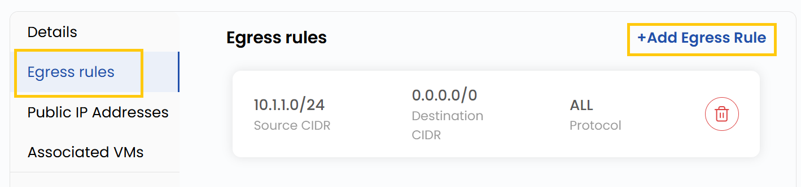
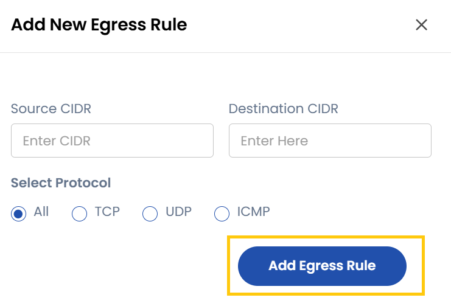

## Egress Rules

- An egress rule controls outbound network traffic from a source to a specified destination based on defined protocols and IP ranges.
- In the **Egress Rules** tab, you can see all egress rules.
- To add egress rule, Click on **Add Egress Rule** this opens the rule configuration form.

### Add New Egress Rules

- Enter the **Source CIDR** and **Destination CIDR**.
- Choose protocol from TCP, UDP, ICMP, or you can select All based on the traffic type.
- Click on **Add Egress Rule** to add the new egress rule.

### Conclusion

**Egress Rules** help control outbound traffic by defining allowed protocols, sources, and destinations. They provide better security and flexibility, ensuring that only the intended traffic leaves your network.

