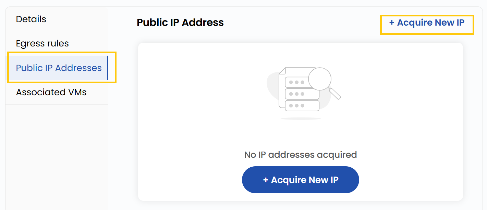
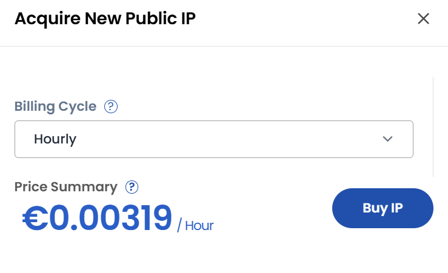

## Public IP Address

- Public IP addresses allow resources in the Public network to communicate with the internet.
- In the **Public IP Addresses** tab, you can see all assigned public IPs.

- Click **Aquire New IP** to request a new public IP. Choose the desired **Billing Cycle** for your network and click on **Buy IP**.

### Conclusion

**Public IP Addresses** enable cloud resources to interact with the internet. From the Public IP tab, you can easily view, acquire, and manage IPs, ensuring smooth connectivity with flexible billing options.

:::tip
**See also:**  
- **[Public Network Overview](./Public%20Network%20Overview.md)**
- **[Create Public Network](./Create%20Public%20Network.md)**
:::
