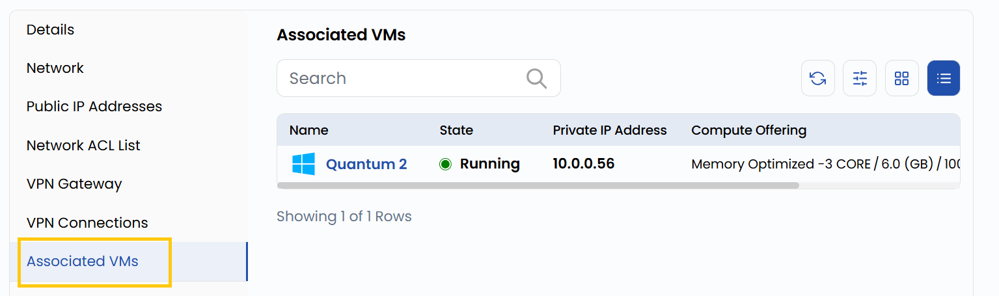

### Associated VMs

The **Associated VMs** tab lists all running VMs instances connected to the VPC network.

### Conclusion

The **Associated VMs** tab gives a clear view of all VM instances linked to the VPC network, helping you monitor and manage connected resources efficiently.
