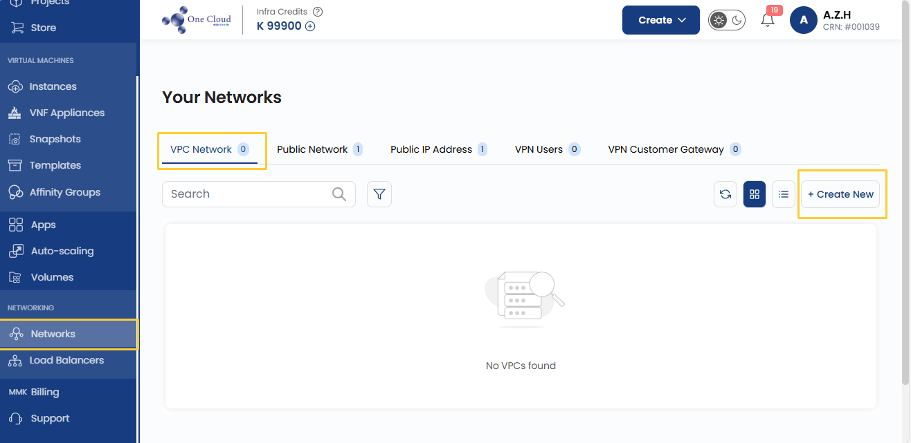
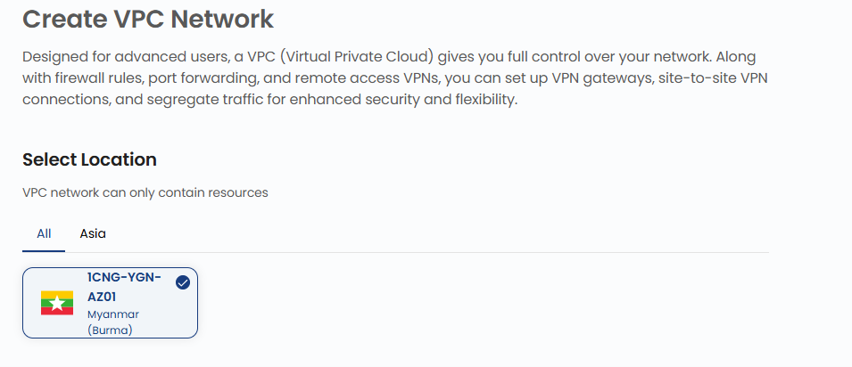
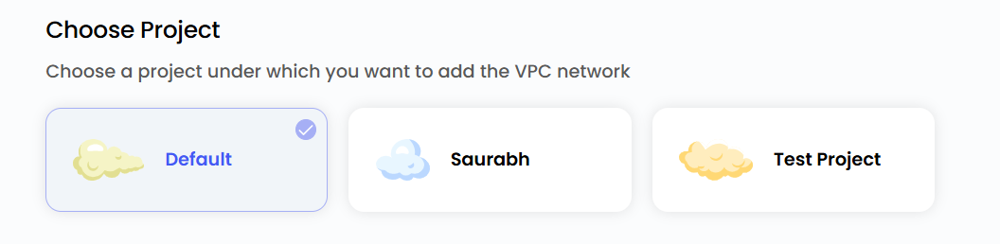
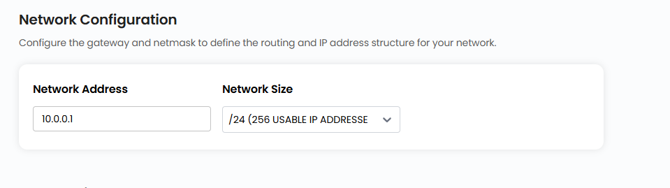
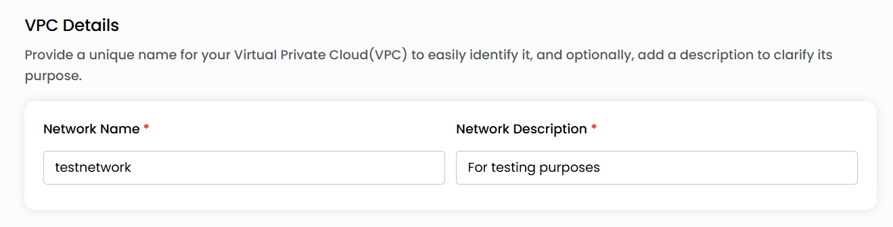
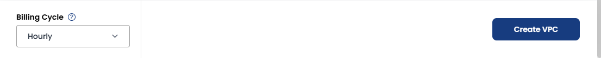

## Create VPC Networks

A **Virtual Private Cloud (VPC)** network in the 1CNG provides an isolated, secure, and scalable environment for cloud resources. It allows users to manage their networking infrastructure efficiently, ensuring communication between cloud instances while maintaining security and performance.

- From the left-hand menu, click on the **Networks** tab.
- You will be redirected to the **Networks** page. Go to the **VPC Network** tab.

- To create vpc network click the **plus (+)** icon located on the right side of the networks page.

### Choose a Location

- Select the data center location where your server will be physically hosted.
- Choose from the available locations listed.

### Assign to a Project

- You can choose projects to assign the server to one of your projects to organize and manage resources effectively.

### Network Configurations

- Configure the gateway and network mask to define the routing and IP address structure for your network. You can choose the size of the network from the available options.

### Choose VPC Network Name

- Provide a unique name for your Virtual Private Cloud(VPC) to easily identify it, and optionally, add a description to clarify its purpose.

### Create VPC Network

- Choose the desired **Billing Cycle** for your VPC Network. VPC supports Hourly, Monthly, Quarterly, Semiannually, Yearly, Bi-annually, and Tri-annually billing cycles. 
- It also supports Date to Date, Fixed Calendar Month, Unfixed Calendar Month, Fixed Prorata, and Unfixed Prorata billing rules.
- It offers multiple VPC packages with varying networking capabilities. This enables flexible network topologies to meet performance, security, and connectivity requirements.
- Verify all the configuration details and review the price summary. Click on **Create VPC** to create the VPC network.    

### Conclusion

Creating a **VPC Network** in 1CNG provides a secure, isolated, and flexible environment for managing cloud resources. With configurable location, project assignment, and network settings, along with multiple billing options, VPC networks ensure optimized performance, scalability, and control over your cloud infrastructure.

:::tip
**See also:**  
- **[VPC Network Overview](./Network%20Overview.md)**
- **[Network ACL List](./Network%20ACL%20List.md)**
- **[VPN Gateway](./Site%20VPN.md)**
- **[VPN Connections](./VPN%20Connection.md)**
:::

