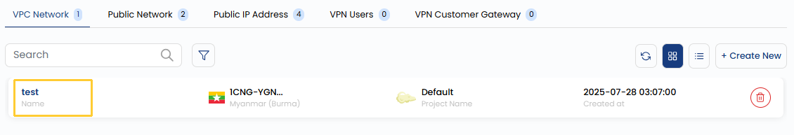

## Network Overview

A Virtual Private Cloud (VPC) is a logically isolated network within a cloud environment. It allows you to control network settings such as IP addressing, subnets, routing, and security.

- To view a network instance, go to the **Networks** and navigate to the **VPC Networks** section, where you can view the VPC network and its size. 

- From **Details** tab you can view the detailed overview of your VPC network.

- **VPC ID**: The ID assigned to the VPC.
- **Description**: A brief summary of the VPC's purpose.
- **Restart Network**: Indicates whether the network can be restarted (True/False).
- **Account Name**: The account that owns the VPC.
- **Domain Name**: The domain to which the VPC is linked.
- **Redundant VPC**: Indicates if redundancy (high availability) is enabled (True/False).
- **Network Domain**: The domain for internal communication within the VPC.
- **CIDR (Classless Inter-Domain Routing)**: Defines the range of IP addresses available within the VPC.

### Conclusion

The **VPC Network Overview** provides essential details about your virtual private cloud, including its ID, domain, IP range, and redundancy settings. This information helps you monitor, manage, and optimize the network to ensure secure and efficient operations.

:::tip
**See also:**  
- **[Create VPC Network](./Create%20VPC%20Network.md)**
- **[VPN Gateway](./Site%20VPN.md)**
- **[VPN Connections](./VPN%20Connection.md)**
:::

