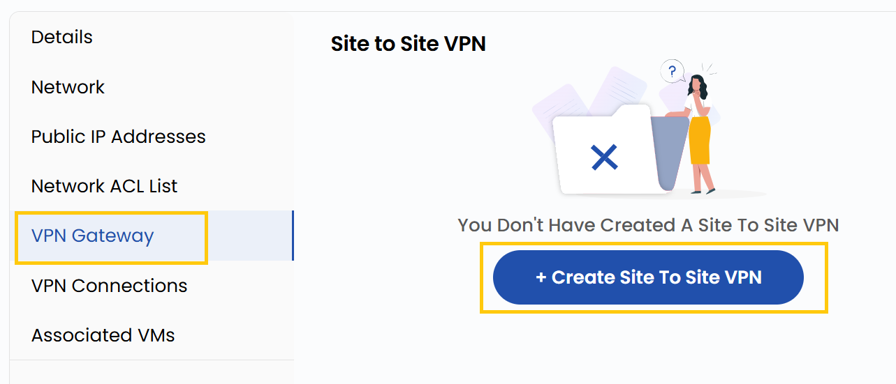

## VPN Gateway

A **VPN Gateway** allows secure communication between your VPC and external networks, such as on-premises data centers or other cloud networks.

- Navigate to the **VPN Gateway** tab to manage VPN Gateway connections.
- You can manage a Site-to-Site VPN, which connects two networks securely.

### Conclusion

The **VPN Gateway** provides a secure bridge between your VPC and external networks, enabling safe data transfer and seamless integration with on-premises or other cloud environments.

:::tip
**See also:**  
- **[VPC Network Overview](./Network%20Overview.md)**
- **[Network ACL List](./Network%20ACL%20List.md)**
- **[VPN Connections](./VPN%20Connection.md)**
:::
