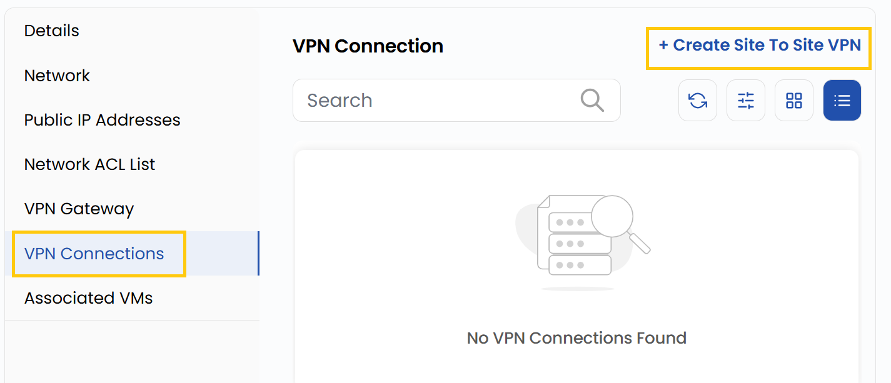
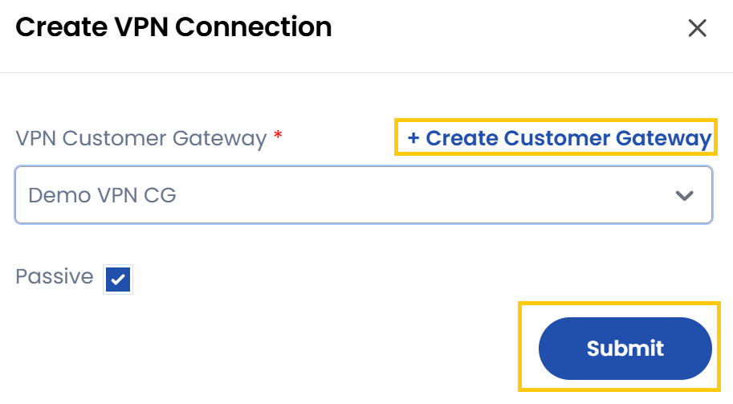

## VPN Connections

A VPN Gateway allows secure communication between your VPC and external networks, such as on-premises data centers or other cloud networks.

- Navigate to the **VPN Connections** tab to manage VPN connections.
- You can create a Site-to-Site VPN, which connects two networks securely.
- Click on **Create Site To Site VPN**

- Select or create the **VPN Customer Gateway**, check if you want **Passive** connection and then click on **Submit**. 

### Conclusion

The **VPN Connections** feature enables you to set up and manage secure Site-to-Site VPNs, ensuring reliable connectivity between your VPC and external networks such as data centers or other clouds.

:::tip
**See also:**  
- **[VPC Network Overview](./Network%20Overview.md)**
- **[Network ACL List](./Network%20ACL%20List.md)**
- **[VPN Gateway](./Site%20VPN.md)**
- **[Network ACL List](./Network%20ACL%20List.md)**
:::