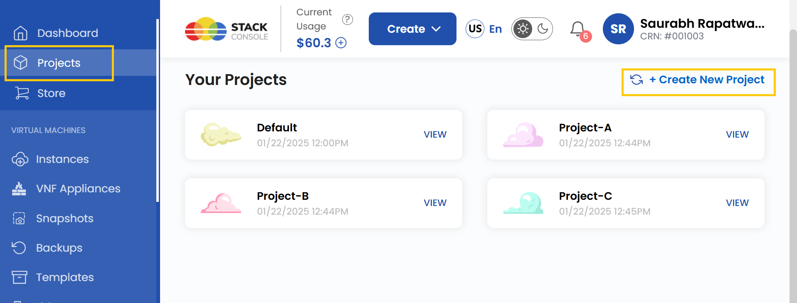
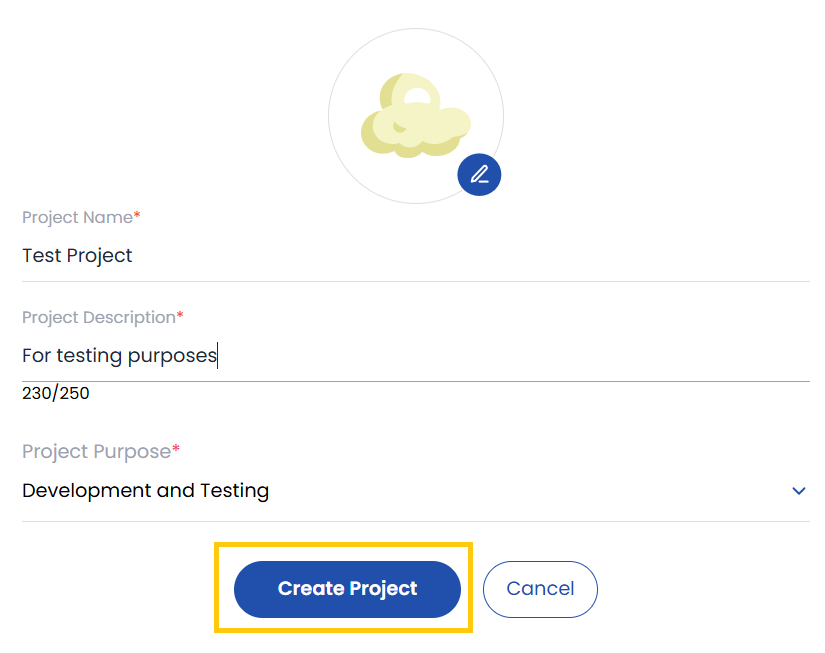
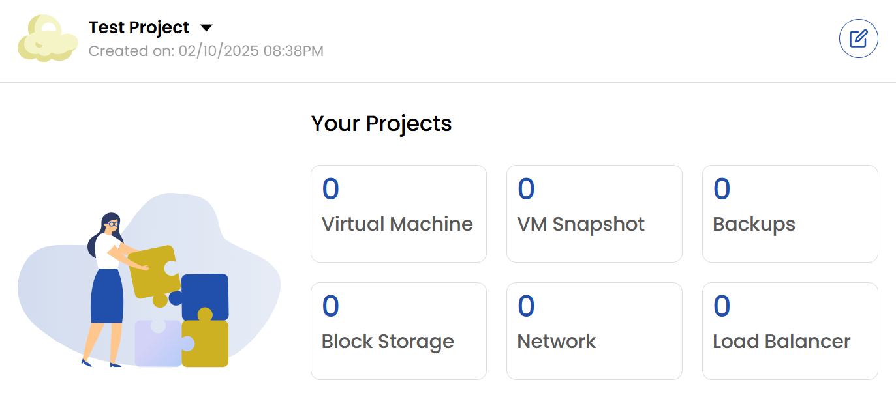
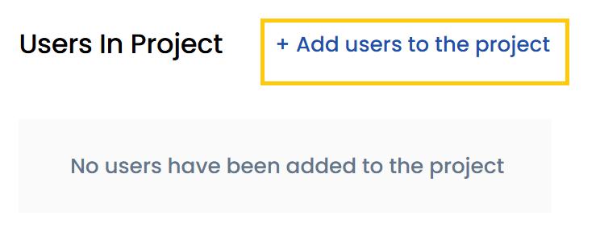
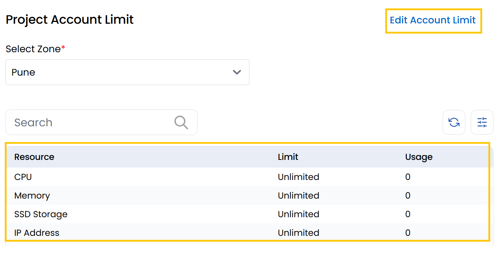
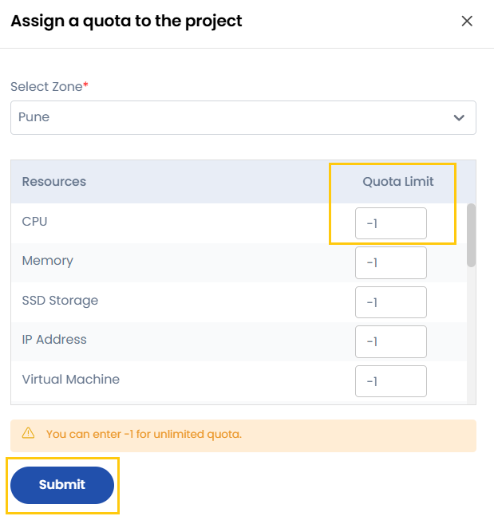

## Creating and Managing a Project

This guide provides step-by-step instructions for creating a project in Stack Console, adding users, and configuring account limits and quotas for the project.

### Creating a New Project

- Navigate to the left-hand menu and click on **Projects**.
- Click on **Create a New Project**.

- Enter the project details such as **Project Name**, **Project Description**, and **Project Purpose**.
- Click on **Create Project**. Your project will be successfully created.

### View Resources for a Project

Once the project is successfully created, you will be able to view the associated project resources.

- **Virtual Machine**: Fully configurable cloud server for running applications or hosting websites.
- **VM Snapshot**: Point-in-time backup of a virtual machine’s state and data.
- **Backup**: Managed backup solution for protecting data and ensuring business continuity.
- **Block Storage**: Additional storage volumes attached to virtual machines for data storage.
- **Network**: Options for public and private networking to connect and manage cloud resources.
- **Load Balancer**: Distributes traffic across multiple virtual machines for high availability.

### Adding Users to a Project

- To add users to your project, click on **Add Users to the Project**.
- Use the search bar to find the user you want to add.
- Click on **Add** to include the user in the project.

### Setting Account Limits for a Project

- You can manage resource limits for a project by setting account limits.
- Navigate to the **Project Account Limit** section. Here, you will be able to view the limit and usage of the resource.
- Select the appropriate **Zone** for which you want to set the limit.

- Click on **Edit Account Limit**. You will be redirected to the **Assign a Quota to the Project** page.
- Select the **Zone** and the specific **Resource** you want to change the quota limit.
- Enter the desired **Quota Limit**. If you set the quota limit to `-1`, it will assign **unlimited** quota for that resource.
- Click on **Submit**.

By following this guide, you can effectively create and manage projects within Stack Console, ensuring seamless collaboration and optimized resource allocation.
