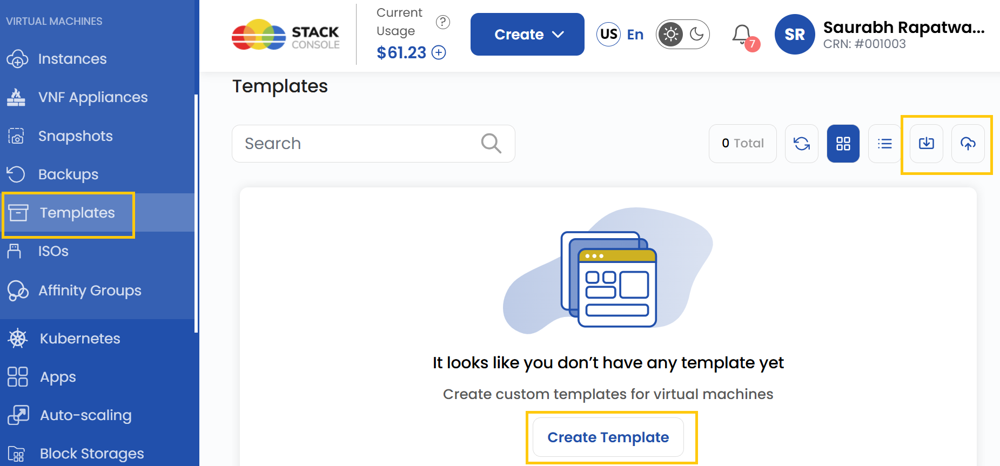
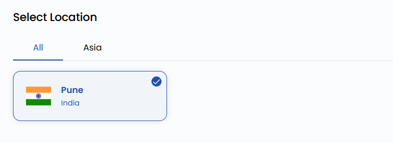
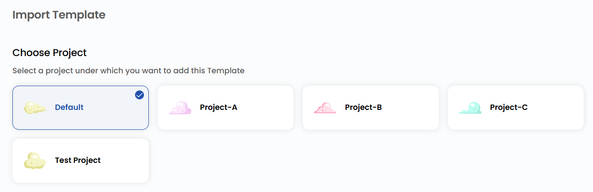
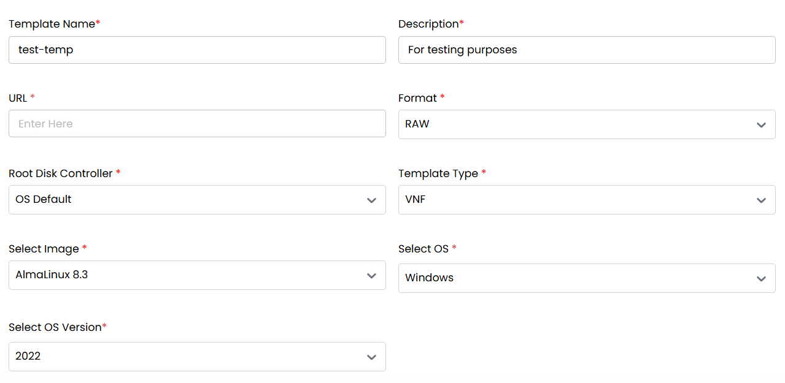
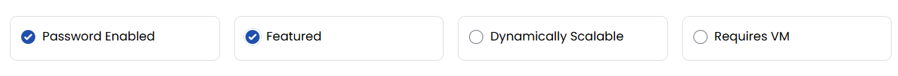

## Template

A **Template** is a pre-configured disk image used for deploying virtual machines (VMs) or containers quickly and efficiently. These templates contain an installed operating system along with predefined configurations, software, and settings, allowing users to create new instances without manually installing and configuring the operating system every time.

----

### Creating Template for Virtual Machine

- From the left-hand side menu, click on the **Templates** tab.
- To create a template, click the **Templates** or **plus (+)** icon located on the right side of the page. This will open the template creation menu.

### Choose a Location

- Select the data center location where your template will be stored.
- Choose from the available locations listed.

### Assign to a Project

- Assign the template to one of your projects to organize and manage resources effectively.

### Template Details

When creating a template, you need to fill out the details with several required fields:

- **Template Name**: Enter a name to identify the template.
- **Description**: Provide details about the template’s purpose and contents.
- **URL**: Provide a link to where the template is hosted (if applicable).
- **Format**: Choose the template format, such as RAW or other supported formats.
- **Root Disk Controller**: Determines the root disk controller that will be used to boot the template (specific to system architecture).
- **Template Type**: Choose the category of the template (e.g., VNF).
- **Image**: Pick the image file associated with the template.
- **Operating System**: Choose the OS the template will use (e.g., Linux, Windows).
- **OS Version**: Select the exact version of the OS.

### Advanced Options

Additionally, you can select from advanced options for the template:

- **Password Enabled**: If selected, a password will be required to access or use the template, adding an extra layer of security.
- **Featured**: Marks the template as a highlighted or recommended option in the system, making it easier to find.
- **Dynamically Scalable**: Allows the template to scale resources dynamically based on demand, useful for cloud-based deployments.
- **Requires VM**: Specifies that this template must be used within a virtual machine environment rather than on physical hardware.

### Create Template

- Choose the desired **Billing Cycle** for your template. Templates support Hourly billing cycles.
- Supported billing rules are Date to Date, Fixed Calendar Month, Unfixed Calendar Month, Fixed Prorata, and Unfixed Prorata.
- Only one template package is supported per zone. This helps standardize deployments across environments.
- Verify all the configuration details and review the price summary. Click on **Create** to create the template for your project.

### Conclusion

By following this guide, you can easily create and manage templates on Stack Console. Templates provide a quick and efficient way to deploy virtual machines or containers with pre-configured settings, saving time and ensuring consistency across deployments. For further assistance, refer to the Stack Console documentation or reach out to support.
