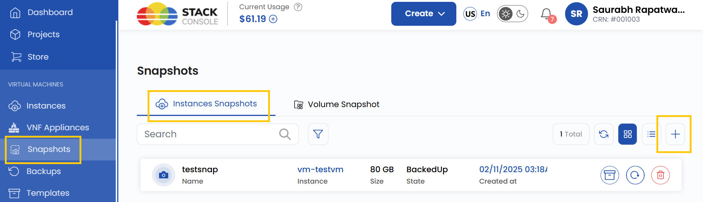
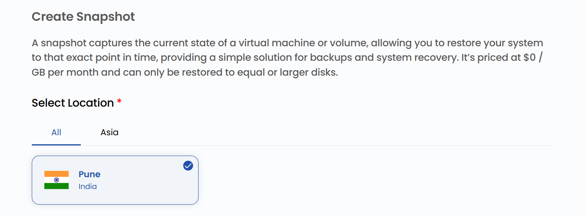
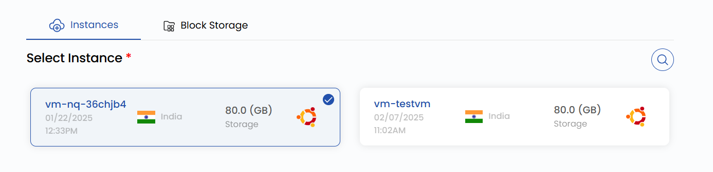
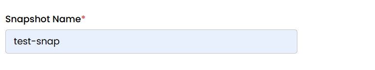

## Snapshot of Virtual Machine Instance

**Instance snapshots** allow you to capture the current state of a virtual machine (VM), including its configuration and data, at a specific point in time. Snapshots are a powerful tool for backup, disaster recovery, and testing purposes. They enable you to quickly restore your VM to the exact state when the snapshot was taken, ensuring data consistency and minimizing downtime in case of failures or accidental changes.

**Stack Console** provides an easy-to-use interface for creating and managing instance snapshots, helping you safeguard your VM data and maintain operational continuity. This guide will walk you through the process of creating an instance snapshot using **Stack Console**.

----------

### Creating an Instance Snapshot of Virtual Machine

- From the left-hand menu, click on the **Snapshots** tab.
- You will be redirected to the **Snapshots** page. Go to the **Instances Snapshot** tab.

- To create a snapshot, click on **Take Snapshot** or the **plus (+)** icon located on the right side of the page.

### Choose a Location

- Select the data center location where your server will be physically hosted.
- Choose from the available locations listed.

### Assign to a Project

- Assign the snapshot to one of your projects to organize and manage resources effectively.

### Choose Instance

- From the **Instances** list, select the virtual machine instance for which you want to create a snapshot.

### Choose Snapshot Name

- Provide a unique **Snapshot Name** for your instance snapshot to identify it easily in your dashboard.

### Create Snapshot

- Choose the desired **Billing Cycle** for your snapshot. You can choose either Hourly or Monthly.
- Verify all the configuration details and review the price summary. Click on **Take Snapshot** to create the snapshot of the virtual machine instance.

### Conclusion

By following this guide, you can easily create and manage instance snapshots on Stack Console. Snapshots provide a reliable way to back up your virtual machines, ensuring data consistency and enabling quick recovery in case of failures or accidental changes. For further assistance, refer to the Stack Console documentation or reach out to support.
