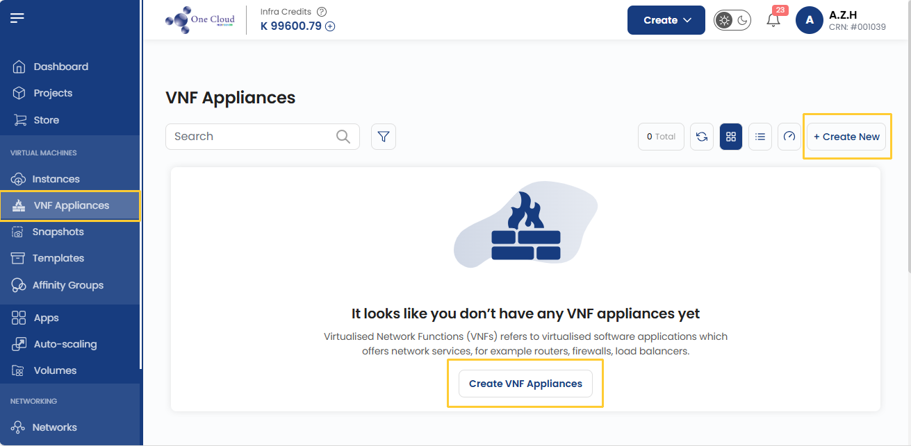
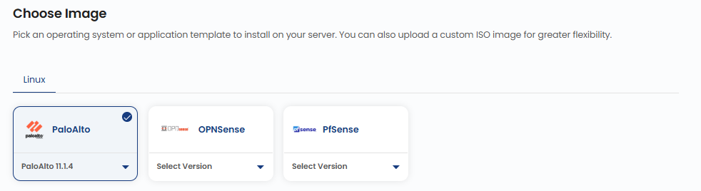
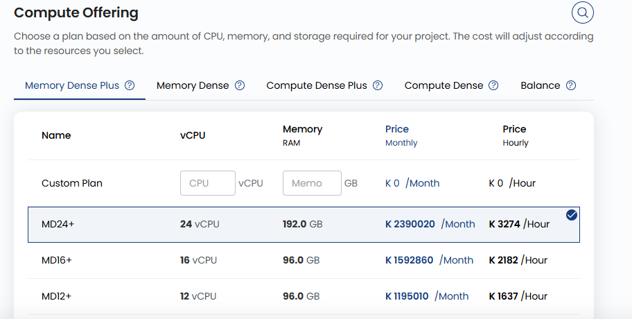
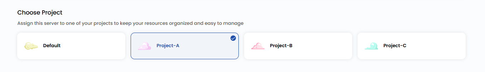
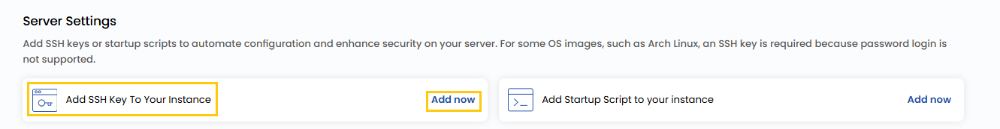
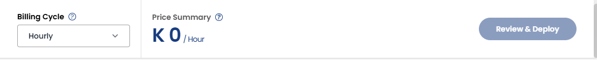

## Virtual Network Function Appliances

**Virtualised Network Functions (VNFs)** refer to virtualized software applications that provide network services, such as routers, firewalls, load balancers, and WAN optimizers. Unlike traditional hardware-based network devices, VNFs run on virtualized infrastructure, offering flexibility, scalability, and cost efficiency.

**1CNG** simplifies the deployment and management of VNF appliances, enabling users to scale and adapt their network infrastructure based on demand. This guide will walk you through the process of creating a VNF appliance using **1CNG**.

----------

### Creating a VNF Appliance

- From the left-hand menu, click on the **VNF Appliances** tab.
- You will be redirected to the **VNF Appliances** page.

- To create a VNF appliance, click on **Create VNF Appliances** or the **plus (+)** icon located on the right side of the VNF Appliances page. This will open the VNF Appliances creation page.

### Choose a Location

- Select the data center location where your server will be physically hosted.
- Choose from the available locations listed.

### Choose an Image

- Select an operating system or application template to install on your server.
- Available options include popular OS images. Alternatively, you can import a custom ISO.
- **Note**: For Microsoft Windows, only official evaluation versions are available.

### Choose a Plan

- Choose a plan based on your requirements like CPU, Memory, Storage, and Bandwidth. You can also create a custom plan if needed.

  - **General Compute (GC)**: Designed for balanced workloads, offering a mix of CPU, memory, storage, and bandwidth. Ideal for general-purpose applications, web servers, and testing environments.

### Assign to a Project

- Assign the server to one of your projects to organize and manage resources effectively.

### Choose a Network

- Select the network for your instance based on your connectivity and security needs. For more details about available network options, refer to the respective network guides.
- If you want to attach the appliance to an existing network, you can choose from available networks.

  - **Public Network**: A simple, pre-configured network designed for external connectivity. Includes cloud firewall protection, port forwarding, and remote access VPN. Ideal for users who require straightforward, hassle-free connectivity.
  - **VPC Network**: An advanced networking solution offering complete control over traffic routing and enhanced security. Supports VPN gateway, site-to-site VPN connections, and traffic segregation.

  **Note:** By default, a VPC is created with a random **CIDR** block and one network tier.

- You can choose whether to enable public IPv4 for internet access to your server.

### Choose Affinity Groups

- Choose an Affinity Group or create one by selecting **Create Affinity Groups**.

### Configure Server Settings

- Configure additional settings for your server.
- You can **Add SSH Key** for secure access. Click on **Add Now** to add an SSH key.
- **Note**: For some OS images, such as Arch Linux, an SSH key is required because password login is not supported.

- Add the name of the SSH key with the key value and click on **Add SSH Key**.

- Add a startup script to automate specific actions during initialization. Click on **Add Now** to add a startup script for your appliance.

### Advanced Settings (Optional)

- Configure additional VM settings for optimized performance, security, and flexibility by enabling **Advanced Mode**.

  - **Boot Mode**: Select Legacy or Secure boot for system startup security.
  - **Boot Type**: Choose between UEFI (modern firmware) or BIOS (traditional firmware).
  - **Enable Dynamic Scaling**: Allows automatic resource scaling based on workload demands.

### Server Hostname

- Provide a unique **Server Name** and a valid **Server Hostname** for your appliance to identify it easily in your dashboard.

### Review and Deploy

- Choose the desired **Billing Cycle** for your appliance. VNF Appliances support Hourly, Monthly, Quarterly, Semiannually, Yearly, Bi-annually, and Tri-annually billing cycles. 
- They also support all major billing rules: Date to Date, Fixed Calendar Month, Unfixed Calendar Month, Fixed Prorata, and Unfixed Prorata.
- They support multiple packages depending on SSD size and data center location. This enables deployment of network functions with regional and performance-based customization.
- Verify all the configuration details and review the price summary. Click on **Review & Deploy** to create the instance.

### Conclusion

By following this guide, you can easily create and manage VNF appliances on 1CNG. VNF appliances provide a flexible and scalable solution for deploying network services in a virtualized environment. For further assistance, refer to the 1CNG documentation or reach out to support.

:::tip
**See also:**  
- **[Public Network](./../../Networks/Guides%20For%20Apache%20CloudStack/Public%20Network/Create%20Public%20Network.md)**
- **[VPC Network](./../../Networks/Guides%20For%20Apache%20CloudStack/VPC%20Network/Create%20VPC%20Network.md)**
- **[Affinity Group ](../../Affinity%20Groups/Create%20Affinity%20Groups.md)**
- **[Public IP Address](../../Networks/Guides%20For%20Apache%20CloudStack/Public%20IP%20Address.md)**
- **[Create Templates](../../Templates/Create%20Templates.md)**

:::
