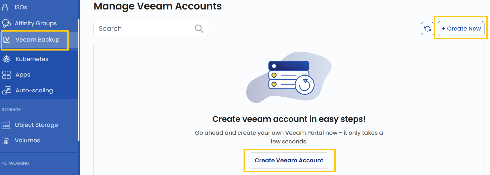
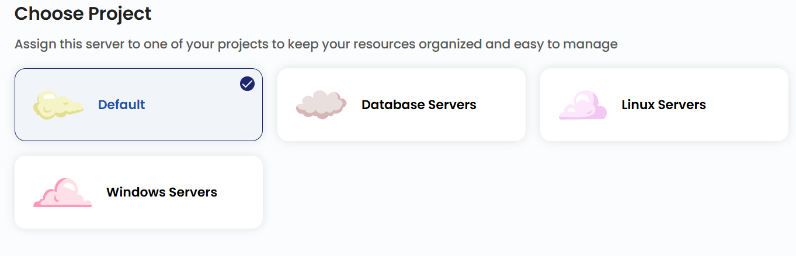
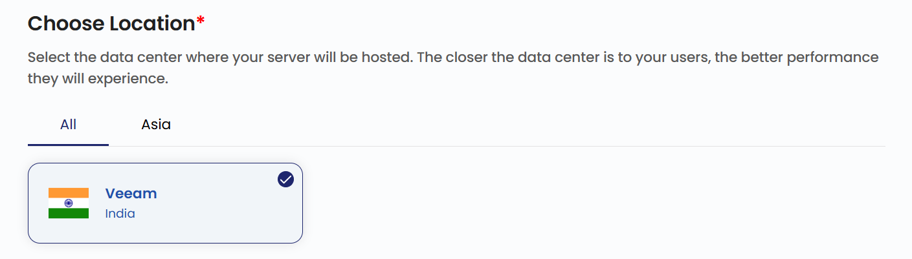
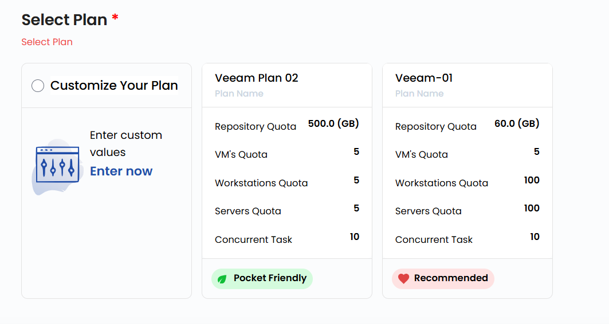
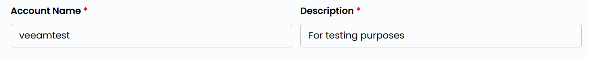
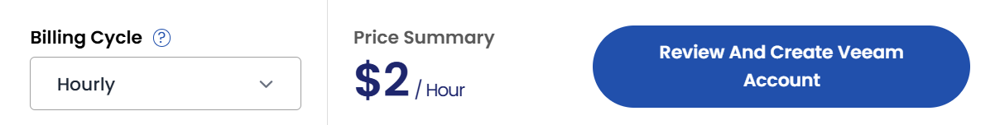

## Veeam Backup

**Veeam Backup** is a comprehensive backup and recovery solution designed to protect your virtual, physical, and cloud-based workloads. In StackConsole, Veeam Backup ensures data availability, disaster recovery, and efficient backup management for your cloud resources. This guide provides step-by-step instructions to create and manage a Veeam Backup account.

-------

### Creating a Veeam Backup

- From the left-hand menu, click on the **Veeam Backup** tab.
- You will be redirected to the **Veeam Backup** page.

- To create a Veeam Backup, click the **Create Veeam Account** or **Create New** button located on the right side of the Veeam Backup page.

### Choose a Project

- Assign the Veeam Backup server to one of your projects to organize and manage resources effectively.

### Choose a Location

- Select the data center location where your Veeam Backup server will be physically hosted.
- Choose from the available locations listed.

### Select a Plan

- Select a plan or alternatively create a custom plan based on your requirements.

- **Repository Quota**: Limits the total storage space available for backup data.
- **VM's Quota**: Restricts the number of virtual machines that can be backed up.
- **Workstations Quota**: Defines the maximum number of workstations Veeam can back up.
- **Servers Quota**: Limits the number of physical servers that can be backed up.
- **Concurrent Task**: Specifies the number of simultaneous backup or restore tasks Veeam can handle.

### Veeam Backup Name

- Provide a unique **Name** and a valid **Description** for your Veeam account to identify it easily in your dashboard.

### Review and Deploy

- Choose the desired **Billing Cycle** for your Veeam account. Veeam Backup supports Hourly, Monthly, Quarterly, Semiannually, Yearly, Bi-annually, and Tri-annually billing cycles. 
- It supports Date to Date, Fixed Calendar Month, Unfixed Calendar Month, Fixed Prorata, and Unfixed Prorata billing rules.
- It supports multiple packages based on SSD sizes and data center locations. This allows flexibility for backup strategies across regions and storage tiers.
- Verify all the configuration details and review the price summary. Click on **Review And Create Veeam Account** to create the Veeam account.

### Conclusion

By following this guide, you can easily create and manage a Veeam Backup account in StackConsole. Veeam Backup ensures data protection, disaster recovery, and efficient backup management for your cloud resources. For further assistance, refer to the StackConsole documentation or reach out to support.

:::tip
**See also:**  
- **[Manage Veeam Backup](./Manage%20Veeam%20Backup.md)**
- **[Auto Scaling](./../Auto%20Scaling/Create%20Auto%20Scaling.md)**
- **[Affinity Group](./../Affinity%20Groups/Create%20Affinity%20Groups.md)**
:::
