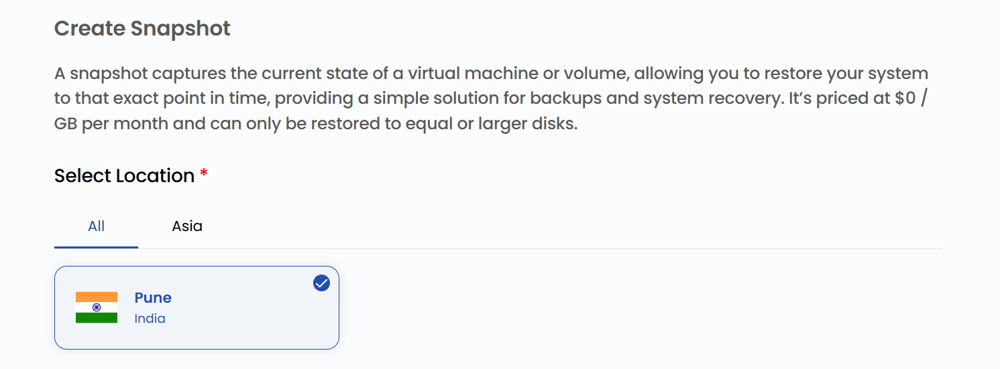
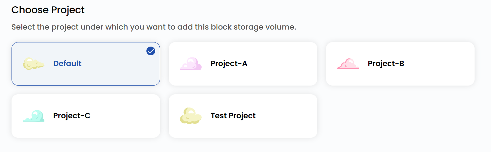

## Volume Snapshot of Virtual Machine

**Volume Snapshots** capture the current state of a volume at a specific point in time, ensuring data integrity and providing a reliable solution for backup and recovery. These snapshots allow you to quickly restore your volume to its exact state at the time of creation, helping to recover from accidental deletion, corruption, or system failures.

With **Stack Console**, you can easily create and manage volume snapshots through an intuitive interface, ensuring your data remains secure and consistent. This guide will walk you through the process of creating a volume snapshot step-by-step.

----------

### Creating a Volume Snapshot of Block Storage

- From the left-hand menu, click on the **Snapshots** tab.
- You will be redirected to the **Snapshots** page. Go to the **Volume Snapshot** tab.

- To create a snapshot, click on **Take Snapshot** or the **plus (+)** icon located on the right side of the page.

### Choose a Location

- Select the data center location where your server will be physically hosted.
- Choose from the available locations listed.

### Assign to a Project

- Assign the snapshot to one of your projects to organize and manage resources effectively.

### Choose Block Storage

- From the **Volumes** list, select the volume for which you want to create a snapshot.

### Choose Snapshot Name

- Provide a unique **Snapshot Name** for your volume snapshot to identify it easily in your dashboard.

### Create Snapshot

- Choose the desired **Billing Cycle** for your snapshot. You can choose either Hourly or Monthly.
- Verify all the configuration details and review the price summary. Click on **Take Snapshot** to create the snapshot of the volume.

### Conclusion

By following this guide, you can easily create and manage volume snapshots on Stack Console. Volume snapshots provide a reliable way to back up your data, ensuring data integrity and enabling quick recovery in case of accidental deletion, corruption, or system failures. For further assistance, refer to the Stack Console documentation or reach out to support.
