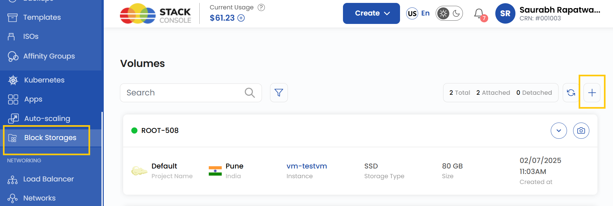
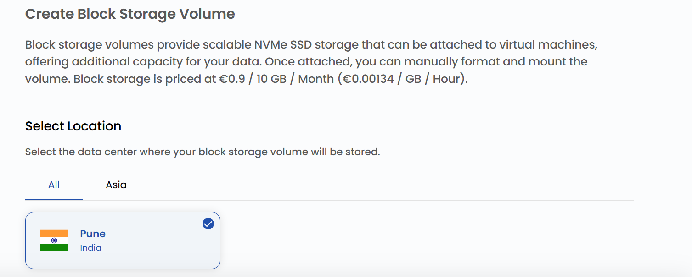
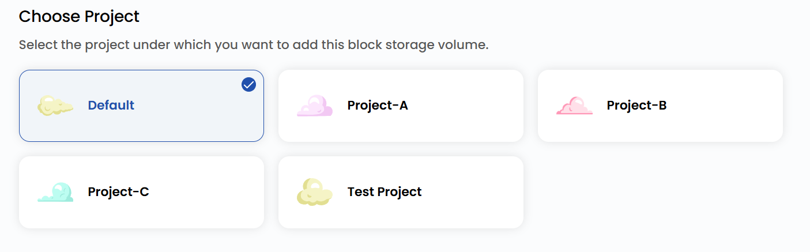
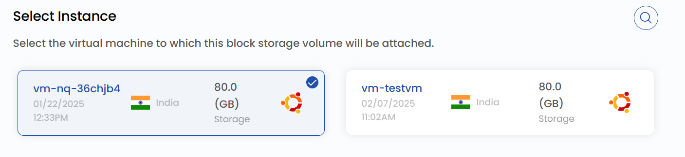
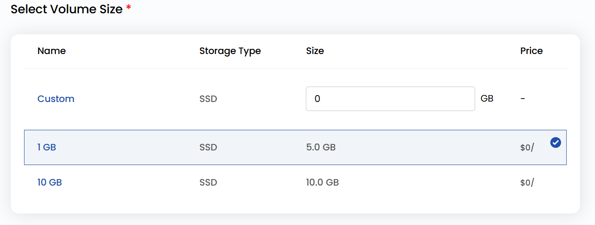
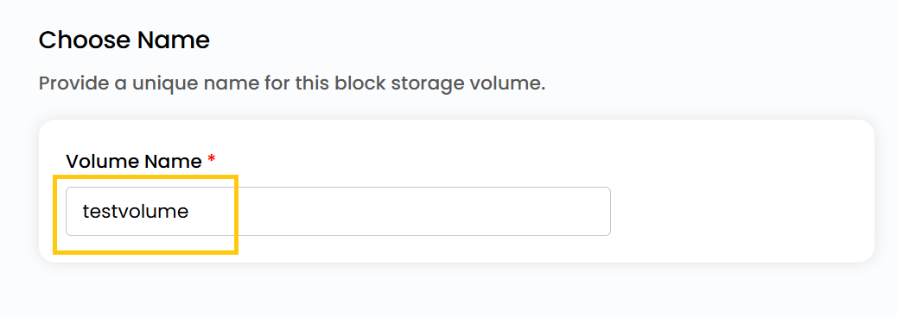
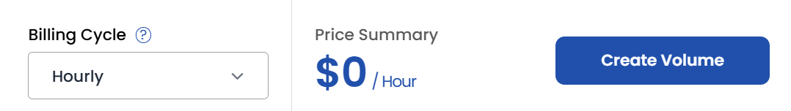

## Block Storage Volumes

**Block storage volumes** provide scalable NVMe SSD storage that can be attached to virtual machines, offering additional capacity for your data. Once attached, you can manually format and mount the volume to extend your VM's storage.

**Stack Console** simplifies the deployment and management of Block Storage, enabling users to scale and adapt their infrastructure based on demand. This guide will walk you through the process of creating and attaching a block storage volume using **Stack Console**.

----------

### Creating a Block Storage Volume on Stack Console

- From the left-hand menu, click on the **Block Storages** tab.
- You will be redirected to the **Create Block Storage Volume** page.

- To create a volume, click on **Create Block Storage** or the **plus (+)** icon located on the right side of the Create Block Storage page.

### Choose a Location

- Select the data center location where your server will be physically hosted.
- Choose from the available locations listed.

### Assign to a Project

- Assign the block storage volume to one of your projects to organize and manage resources effectively.

### Choose Instance

- Select the virtual machine instance to which you want this block storage volume to be attached.

### Select Volume Size

- Select a volume size based on your requirements like **Storage Type** and **Size**. You can also create a custom volume if needed.
- These are some available options and their plans:

### Choose Volume Name

- Provide a unique **Volume Name** for your volume to identify it easily in your dashboard.

### Create Volume

- Choose the desired **Billing Cycle** for your volume. You can choose either Hourly or Monthly.
- Verify all the configuration details and review the price summary. Click on **Create Volume** to create the volume.

### Conclusion

By following this guide, you can easily create and manage block storage volumes on Stack Console. These volumes provide scalable and high-performance storage solutions for your virtual machines, enabling you to meet your data storage needs efficiently. For further assistance, refer to the Stack Console documentation or reach out to support.
