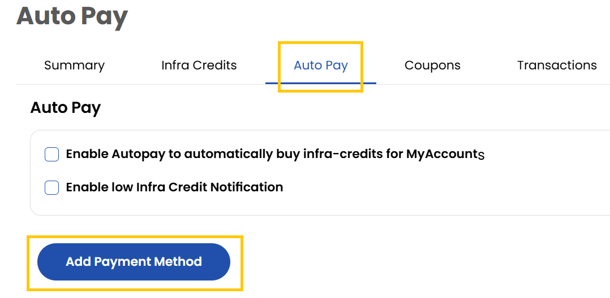

- You can use saved payment methods that are automatically charged at the close of each billing cycle or can be used to pre-pay your bill. You can add payment method as and enable Autopay option.
- Enable low Infra Credit Notification to get notified when the credits present in the account are low.

