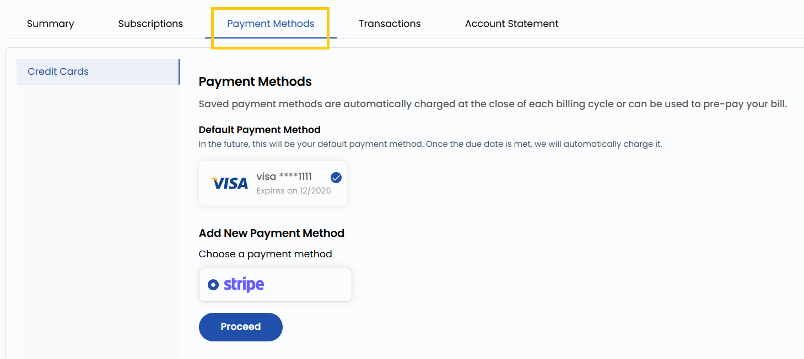

## Payment Methods

The **Payment Methods** tab allows users to manage their payment preferences. Users can purchase **Infra Credits** by setting a payment method. To add Infra Credits, users simply enter the desired amount, and the corresponding charge is applied to the default payment method set in their account. This feature helps in maintaining a seamless billing experience without interruptions.

- You can use saved payment methods that are automatically charged at the close of each billing cycle or can be used to pre-pay your bill. You can add payment method as Manual as well.

