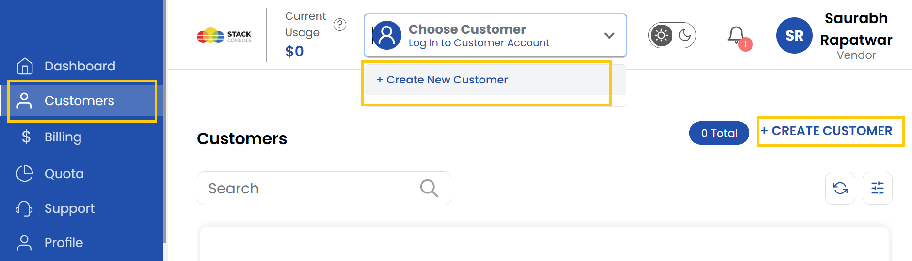
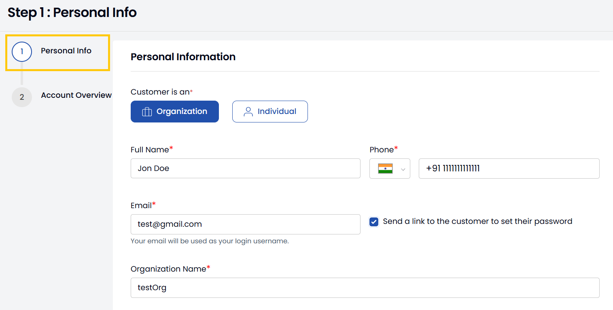
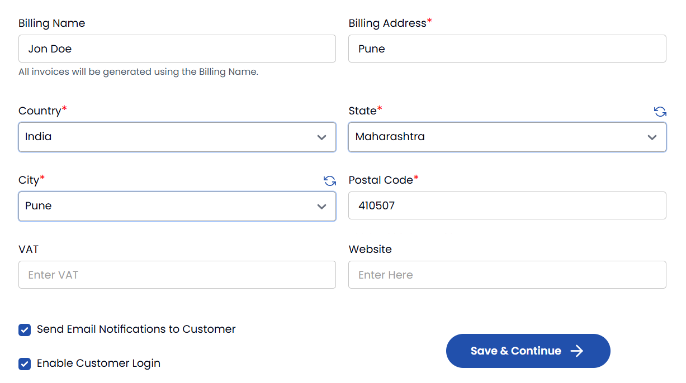
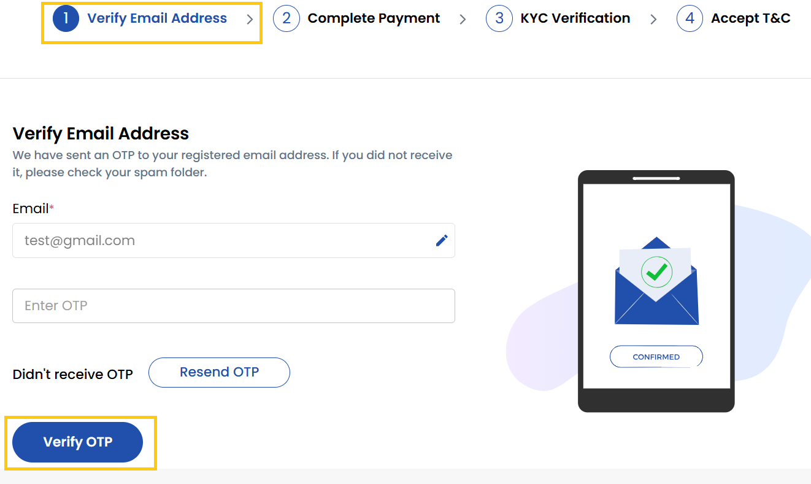

## Create Customer For Vendor {#Register-Account}

This guide provides a step-by-step tutorial to help you create a Customer for Vendor in Stack Console account, set up billing, verify and access your account.

- From the left-hand menu, click on the **Customers** to display a full list of customers created.
- To create customer, there are two ways two create a customer in Vendor Portal:
    - You can create a customer by choosing **Create New Customer** from top of the page.
    - Else, click on **Create Customer** from right-hand side of the page. 

- Enter the necessary details, such as your name, email address, and password.
- Choose a customer type:
    - **Individual**: For personal use; enter details like your address.
    - **Company**: For organizational use; provide details such as your company name, website, and address.

- Enter your billing information such as billing address and VAT/GST details. Alternatively, you can select Send Email Notifications to Customer to send notifications and Enable Customer Login. Click on **Save and Continue**. 

- View the account details and create the account.
- Check your email inbox for a verification email from Stack Console containing a One-Time Password (OTP).
- Enter the **OTP** in the provided field on the website. Click **Verify** to confirm and proceed to the billing setup.

- **Complete Payment**: Select credit card, bank transfer, or other available payment options and enter valid payment details and complete the payment procedure.
- **Complete KYC**: Submit required identity documents (like passport or driver's license) for Know Your Customer verification.
- Review the **Terms & Conditions** of the platform carefully. Accept the terms to complete the registration process.
- Your Customer is created successfully. To access the customer, click the **Login** icon on the right side of their entry to access their dashboard directly.

----------

### Conclusion
You've successfully created a customer account in Vendor Portal. The customer can now access their dashboard and utilize Stack Console services.
