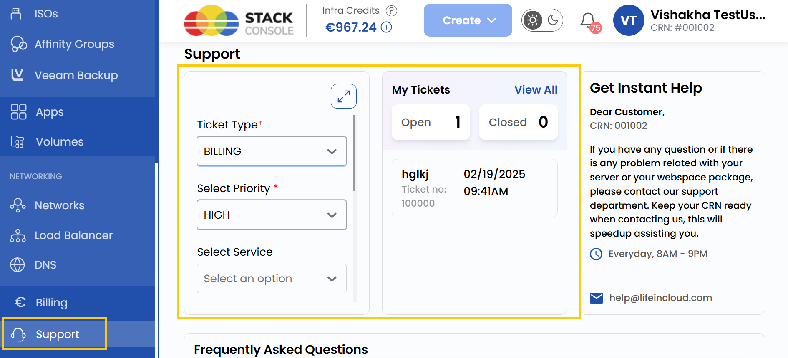
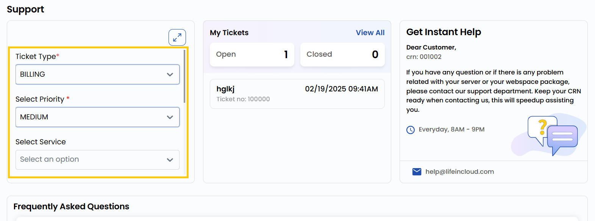
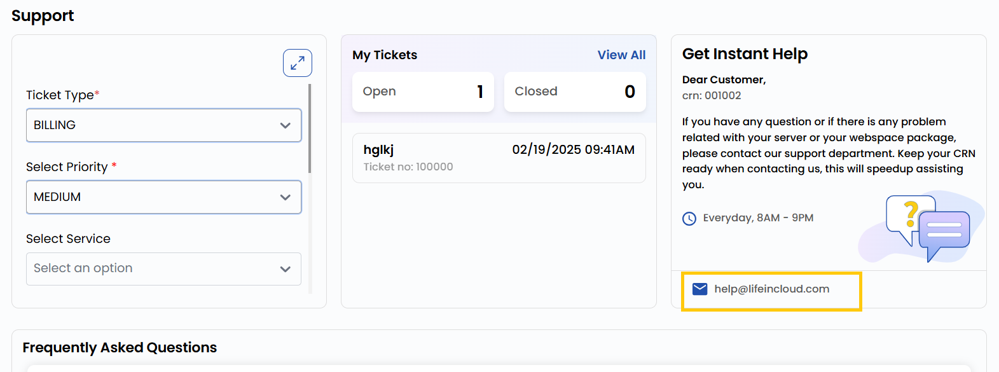

## Support

**Support** in **Stack Console** provides assistance to users in accessing, managing, and troubleshooting their systems. It ensures that users can effectively utilize their technology resources, resolve issues, and optimize performance.

### Submitting and Managing Tickets

- To submit a support ticket, select the **Ticket Type** based on your issue. Choose the **Priority** to indicate urgency and select the relevant **Service** related to your query.
- Enter the **Subject** and **Message**, then click on **Submit**.
- The **My Tickets** section allows you to view and check the status of already opened tickets and closed tickets.

### Need Immediate Assistance

- If immediate help is needed, reach out via email at **help@lifeincloud.com** to our customer service. Our support team will work to provide a solution to your issue.
- Keep your CRN (Customer Reference Number) ready for a faster response.
- **Note**: Our support services are open every day from 8 AM to 9 PM.

